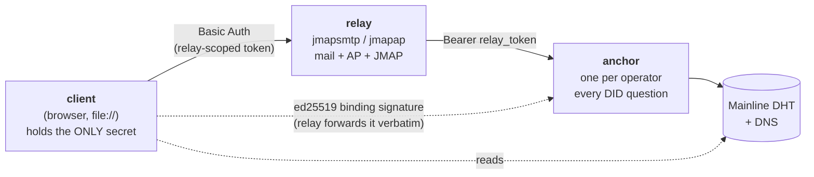
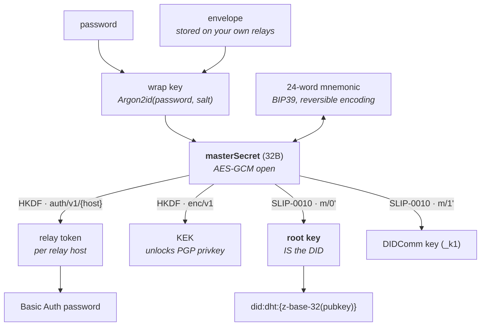
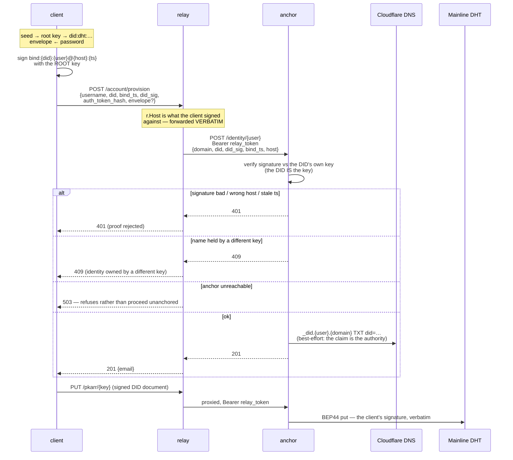
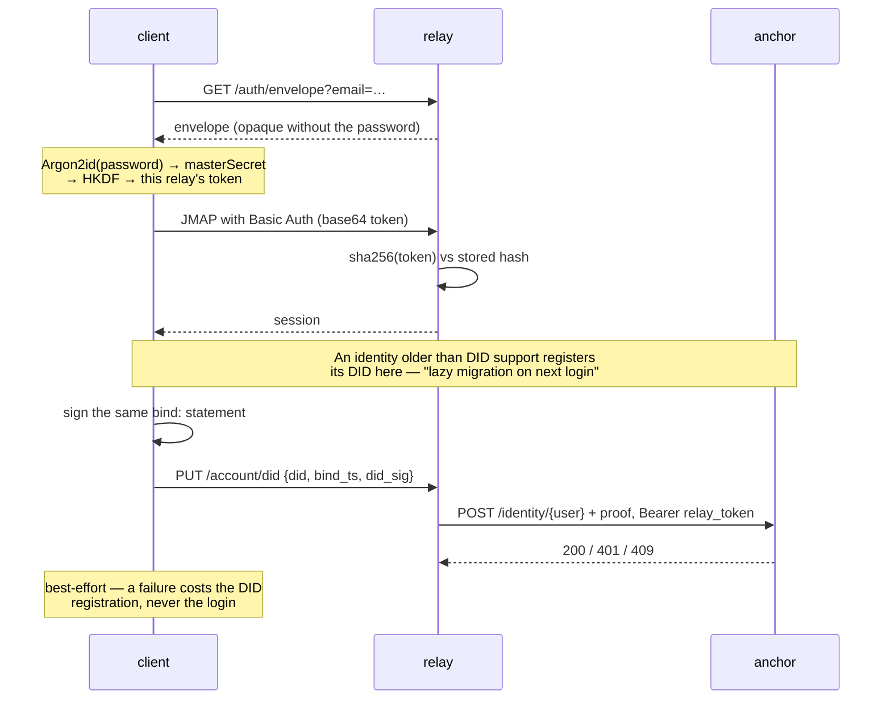
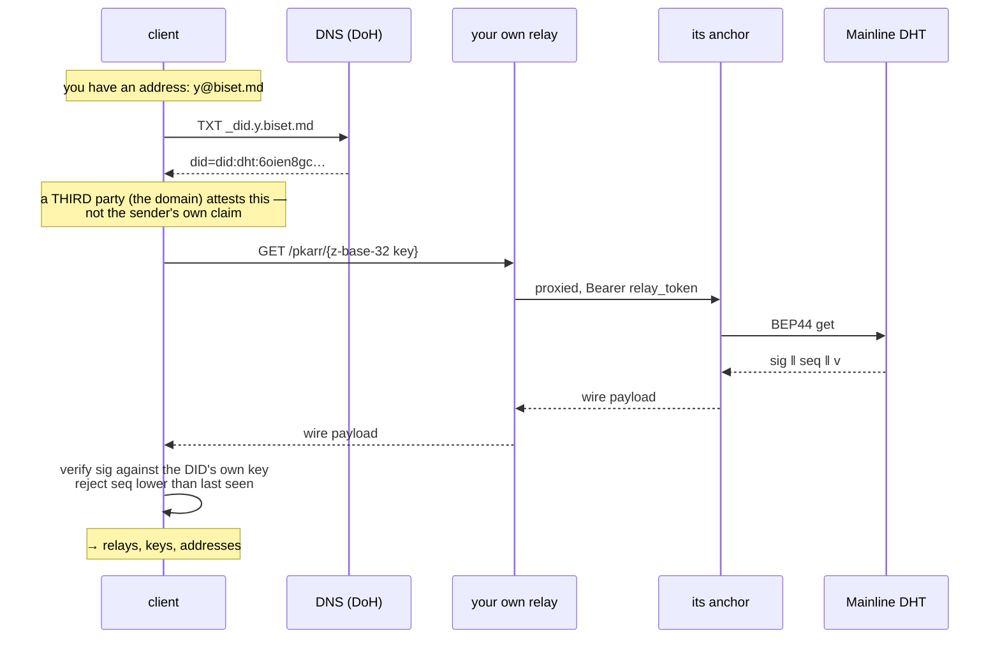
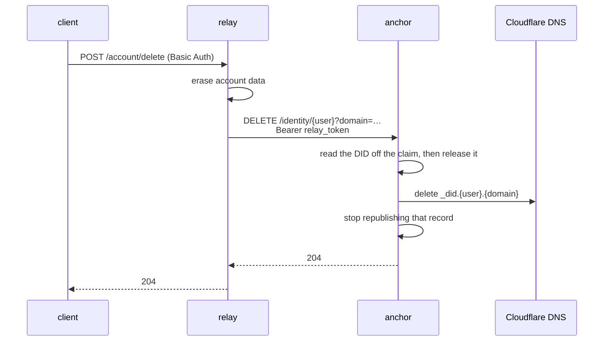

# DOCUMENTS ARCHIVES

# biset-anchor — 設計文書

status: **本番稼働中(2026-07-17)。決定1の吸収は全て完了** — registry + DNS /
binding検証 / mediator / didindex + `by-did`複数アドレス / pkarrゲートウェイ、
すべて`anchor.biset.md`(TS)に集約され本番投入済み。**relay側のDIDコードは
961行 → 222行、しかもDIDが何かを知らない222行**(claim転送・pkarr中継・認証トークン)。
**段階的移行(決定5)も段取り5まで完了 — Go版anchorは引退した(2026-07-17)。**
mediatorは`https://anchor.biset.md`で**本番稼働中**、`~/didmediator`はGitHubで
archive済み。**この文書が予定していた作業は全て終わっている。**

関連: `ARC.md`(現在の姿)、`DID.md`(identity層の決定史)、`PLAN.md`(DIDComm)、`JOURNAL.md`(作業ログ)。

用語について: 本文書で **anchor** と書くとき、当時デプロイされていた
`go-didanchor`(claim registry + DNS、314行)を指すときは「**現anchor**」、
本文書が提案した拡張後のものを指すときは「**biset-anchor**」と書き分けている。
**この区別は2026-07-17に意味を失った** — 移行が完了し、`go-didanchor`は引退・削除された。
以降「**現anchor**」と書いてある箇所は全て**過去形として読むこと**(書かれた当時の
現在であって、今日の現在ではない)。今日動いているのは`biset-anchor`だけ。

## Motivation

did:dht関係の仕事が3箇所に散っている。

| 場所 | 中身 | 行数 |
|---|---|---|
| `go-jmapserver` | `didbind.go` / `anchorclient.go` / `cloudflare.go` / `didindex.go` / `pkarr/` | 961 (Go) |
| `go-didanchor` | claim registry + DNS | 314 (Go) |
| `didmediator` | DIDComm mediator | 964 (TS) |

> **この3つの出所は、もう探しても無い(2026-07-17)。** 本文書とTS版のコードは
> `go-didanchor`を14箇所で引用している(「Ported from go-didanchor's anchor.go」、
> 決定1bの「Goソースで原因を特定」など)。**引用は履歴として今も正しいが、
> 裏を取り直すことはできない** — `~/go-didanchor`(444行、git管理外・remoteも無かった)は
> **ユーザーの判断で完全削除**した。コンパイル済みバイナリだけは
> `v2:/root/anchor-go-retired-backup-20260717.tgz`に残る(ソースは入っていない)。
> `didmediator`は対照的に**GitHubでarchive**されており、`54cd78d`が読める。
> `go-jmapserver`の各ファイルはgit履歴に残る。

**目的はコード重複の解消でも運用の簡素化でもなく、概念の整理**(2026-07-16、ユーザー明言)。
DIDの責務を一箇所に集め、relayは**JMAPサーバーとして清潔である**ほど良い、という
主従を明確にする。

## 中心的な定式化

> **anchorがあれば、ユーザーはrelayを統合するdidを持てる。anchorが無ければ、bisetは
> ばらばらなJMAP relayのclientでしかない。**

これは新概念ではない。**既存の語彙に実体を与える作業**である。

### 語彙の統一(本文書の副次的な成果)

`DID.md`は**同じspectrumを2つの語彙で書いている**:

```
DID.md:81    ## Roles (no-core preserved)
DID.md:243   | coreless | DID, no core | DID, with core |    ← core語彙
DID.md:260   | anchorless | with_anchor |                    ← anchor語彙
ARC.md       "Anchorless / with_anchor is a config-driven spectrum"
go-jmapserver/anchorclient.go  // ... (see DID.md "DID is optional" / "no-core")
```

「core」と「anchor」は最初から同じものの別名として並走していた。
**本文書は`anchor`に一本化する**。理由:

- **公開文書(`ARC.md`)が既に採用しているのは`anchorless`/`with_anchor`**。
- **コードも設定も既に全部anchor** — `anchor_url`、`AnchorClaim`/`AnchorRelease`、
  `go-didanchor`。改名churnがゼロ。
- **「core」は語義矛盾** — coreは「中核・必須」を含意するのに、この物はoptional。
  READMEの`no core server`とも音が衝突する。

**README/ARC.mdの"no core server"とは衝突しない** — あれは*メッセージ/状態*の
中心サーバを否定する原則(relayは独立、状態を共有しない)。anchorが司るのは
*identity*であって、メッセージでも状態でもない。両者は最初から共存していた。

**名前の代償(承知の上で受け入れる)**: 「anchor」はDIDComm mediationやDHT
ゲートウェイの役割を過小に語る(錨を下ろす動作ではない)。「あなたの身元を世界に
固定するもの」——DNS anchor / DHT(解決可能性の維持)/ mediator(到達可能性)——と
読めば一応比喩に乗る、という程度。

## Decisions

### 0. 名前は `biset-anchor`(決定、2026-07-16)

リポジトリ・バイナリとも`biset-anchor`。TS化するので`go-`接頭辞は外れる。
`didmediator`は吸収されて消える。

### 1. did:dht関係の仕事はすべてanchorの責務(決定)

relayからDIDの**ロジック**を消す。relayが持つのは
「anchorへDIDの事実を転送する薄い共通モジュール」だけ。

**biset-anchorへ移る:**

**決定1は完了(2026-07-17)。全て本番投入済み:**

| 対象 | 現在地 | 状態 |
|---|---|---|
| `VerifyDIDBinding` | `didbind.go` (112行) | **完了** — 削除済み。relayは素通し |
| claim registry + DNS | `go-didanchor` (314行) | **完了** — 現anchor = biset-anchorの中核 |
| `CloudflareAnchor` | `cloudflare.go` (116行) | **完了** — Go版も削除済み(import元ゼロだった) |
| DID→アドレス索引 | `didindex.go` (127行) | **完了** — 削除済み。`by-did`に統合(下記) |
| DIDComm mediation | `didmediator` (964行) | **完了** — `src/anchor/mediator/`に吸収 |
| pkarrゲートウェイ | `pkarr/` (538行) | **完了** — `src/anchor/pkarr.ts`へ。relayは中継のみ |

**relayに残る(薄い共通モジュール、~60-80行):**

```go
anchor.Claim(anchorURL, localpart, domain, fingerprint, did, didSig, bindTS, host) → ok|conflict|invalid
anchor.Release(anchorURL, localpart, domain, did)
```

### 1c. anchorは自分のrelayだけに書かせる(2026-07-17 — **決定1の論法が前提を外していた**)

決定1でhost検証をanchorへ移す時、根拠をこう書いた(`cbc7d5d`、`didbind.ts`にも転記):

> A relay lying about the host still cannot forge a signature for a host it
> doesn't hold one for, and it could already claim anything it liked on the
> anchor without this check at all — **the anchor has never authenticated its
> relays**.

**各節は正しいが、下敷きの前提が誤っていた** — 「anchorと話すのはrelayだけ」を
暗黙に仮定している。何もそれを強制していなかった。脅威は「嘘をつくrelay」ではなく
**「誰でも」**だった。私はこの一文をコメントに書き写しながら、前提を検算しなかった。

**本番で実証(2026-07-17、アカウントもDIDも持たないラップトップから)**:
`POST /identity/<任意の名前>` に素のfingerprintだけ → **201**。`DELETE` → **204**。
よって成立する攻撃: 生きたidentityのclaimをDELETE(**DNS TXTも道連れに撤回される**)
→ 自分のfingerprintで再claim → 本物の持ち主は締め出される。以後その人のclaimは
本物のenvelope fingerprintを持つので、**永久に409「different key」**。
fingerprintを汚すだけでも、setup-token signup・`/account/did`・envelope rotationが
全部409で弾かれ続ける。

**なぜ気づきにくかったか**: fingerprintのみのclaimは**設計上、証明を持たない**
(backfillとenvelope rotationには証明すべきDIDが無い)。つまり
**「anchorに到達できる」が認可の全てだった**。そしてanchorは公開されている —
DIDComm mediatorがクライアントから到達可能でなければならないため。

**決定**: `POST`/`DELETE /identity/*` と `/pkarr/*` は共有シークレット
(`relay_token` ⇔ relayの`anchor_token`、`Authorization: Bearer`)を要求する。
**`GET`は当初公開のままにした** — アドレスはDIDから発見できるべきもので、`by-did`も正引きも
DID/DNS層が既に公開している以上を漏らさない、という理由。**しかしその後(2026-07-17、下記A)、
読み取りルート自体を削除した** — 呼び出し元が本当にゼロ(クライアントはanchorのURLを知らず、
address→DIDはDNSに聞く)で、公開面は「誰も呼ばない防御対象」でしかなかった。結果、anchorの
公開面は mediator + トークン付き書き込み + トークン付き`/pkarr`だけになり、他人が読めるものはゼロ。

**トークンは必須。無認証モードは無い。** 省略可にすると今日の穴が既定値として残る。
`freshness.ts`のSeqStoreと同じ理屈 — 「デフォルトを置かなかったのが要点。暗黙の
フォールバックは*静かな*セキュリティ劣化になる」。anchorもrelayも未設定なら起動を拒否する。

**403であって401ではない** — 401は既に「binding証明が拒否された」を意味し、relayは
それをユーザーの問題として報告する。relay自身が弾かれたのはユーザーには何もできない話で、
混ぜるとrelayが「あなたの署名が失敗した」と嘘をつく(証明は見られてすらいない)。

**これは新規モジュールではなく、既存`anchorclient.go`(68行)の自然な進化**。
`VerifyDIDBinding`が`Claim`に吸収されるのが要点 — relayは署名を検証せず、
anchorへ渡して判定を受け取るだけ。これが可能なのは決定2(anchorless = DIDなし)の
おかげで、「anchor無しでもbinding検証だけは成立する」という中間状態が消えるため。

**relay側のDIDコード 961行 → 222行、達成(2026-07-17)。** しかも**残った222行は
DIDが何かを知らない** — `anchorclient.go`(108)はclaimとproofをanchorへ転送するだけ、
`pkarrproxy.go`(77)は鍵を不透明なパス片・本文を不透明なblobとして中継するだけ、
`authtoken.go`(37)はDIDと無関係な認証トークン。`didbind.go`は`authtoken.go`へ改名した
(DID material が1行も残らなかったため)。

**`/identity/local/<did>`は`by-did`に吸収されて消える(決定、2026-07-16)。**
呼び出し元は本当にゼロ(biset本体・全relay・didmediator・ビルド済み`dist/app.js`、
どこからも呼ばれていない)だが、**これはバグではなく設計通り**だった —
`didindex.go`のコメントが意図を明示している:

> RegisterDIDLocalIndex exposes the local index **for operational lookups**
> ("what accounts does this DID have on this relay" — a question that came up
> repeatedly during development, **done by hand via SSH each time**).

つまりクライアントAPIではなく**開発時の運用デバッグ用**。人間が必要な時に叩くもの。

よって「移すか消すか」の二択ではなく、3つに分解される:

| 部分 | 行き先 |
|---|---|
| 索引データ(`_did_local/<did>`、`RecordLocalDID`/`RemoveLocalDID`) | **anchorへ** — cross-relay情報なので本来anchorのもの |
| `LookupLocalDID` | 索引と一緒にanchorへ |
| `GET /identity/local/<did>` | **消える** — 下記の通りanchorの`by-did`が上位互換 |

**現anchorには既に同じ問いに答えるエンドポイントがある:**

```
GET /identity/by-did/<did>  → {domain, localpart}    ← 現anchor
GET /identity/local/<did>   → {addresses: [...]}     ← relay(このrelay上のみ = 劣化版)
```

anchorがrelay横断の索引を持てば`by-did`が**全relayを跨いだ答え**を返せるので、
relay版の存在理由が消滅する。`didindex.go`のコメント自身が
"same sensitivity level as **the anchor's own by-did lookup**" と等価物の存在を
認めている。

**`by-did`の戻り値は複数対応へ拡張が要る** — 今は`{domain, localpart}`単数だが、
1つのDIDが複数アドレス(mail/AP、移行後の旧新)を持つのが前提なので
`{addresses: [...]}`相当へ。これは現anchorのAPI変更になるため、移行段取り(決定5)の
どの段階で行うか要検討。

### 1b. DID→アドレス索引は「導出」する、保存しない(決定、2026-07-16 — **本番の不整合を発見して**)

現anchorはDID→アドレスを`<dataDir>/_did/<did>`に**独立したファイルとして保存**する。
本番データを検証した結果、**これが実際に壊れていた**:

```
本番 v2 (/root/anchor/data):
  identity.fp  7件   _did索引  4件
  biset.md/y → did:dht:6oien8gc…   ← DIDを持つのに索引が無い(= あなたのメイン)
  by-did/did:dht:6oien8gc… → 404   ← 本番で実証
```

**原因(推測ではなくGoソースと本番のタイムスタンプで特定):** 索引が書かれるのは
`writeAnchorRecord`のみ。ところが`claimIdentity`の**冪等パス**(fpもdidも既に
揃って一致)は`return true`で**早期returnし、何も書かない**。よって一度欠けた
索引は**再claimしても永久に戻らない**。欠けた原因はv1→v2移行(v1の旧データには
索引が存在した)。`orillo.org/y`が生き残ったのは移行後に書き直されたためで、
v2のファイル時刻を見ると他は全て`identity.fp`と`_did/`が**同一秒**——正常に
書かれた組だけが揃っている。

**実害は現時点でゼロ**(`by-did`の呼び出し元がどこにも無い)。ただし決定1で
`by-did`が「relay横断のDID→アドレス」という中心的役割を担うので、**そのとき実害化する**。

**決定: 索引ファイルを持たない。起動時に`identity.fp`を走査して構築し、メモリで保つ。**
索引は`identity.fp`の**純粋な関数**であり、別コピーを持つ意味が無いのに
correctnessを損ねていた(Goは索引の書き込みエラーも`//nolint:errcheck`で握り潰す)。
`_did/`のファイルは**二度と読まない**。Go版引退後に削除してよい。

**この決定により、本番への書き込み修復が不要になった** — 索引を導出するようにした
だけで、壊れた状態が存在しなくなる。**本番データのコピーで実証(2026-07-16)**:

```
                     本番Go版      TS版(導出)
biset.md/y by-did →  404          200 {"domain":"biset.md","localpart":"y"}   ← 修復
他4件      by-did →  一致          一致                                        ← 回帰なし
正引き 全7件         一致          一致
本番データ                          無変更(最終更新は検証以前のまま)
```

### 1d. claimはDIDだけを名指す — fingerprintを廃止(2026-07-18、ユーザー発案)

**問いはユーザーから**: 「ap の alice@t.biset.md と smtp の alice@t.biset.md が
同一人物でなければならない、という厳格な合意は要らないのでは。**DIDがアイデンティティ
アンカーなのだから**、別々のDIDが同名アドレスを持つのは単に同名の別人。同一DIDが両方を
持つのは良いが、mandatoryである必要はない。」

半分はその通りで、その半分だけ実装した。**envelope fingerprintを廃止した。**

fingerprintはDID以前の遺物で、`claim()`が自分自身と比較する以外**誰も読んでいない**。
唯一の仕事は「DIDを持たない同名2アカウントのdivergence検出」だが、DIDなしアカウントは
**何も公表しない**(DNSレコードも document もない)ので、その"split"は「同名の別人」= 問題
ではない。しかも実害があった: 今朝のsquatはfingerprint汚染攻撃で、汚された名前は本物の
持ち主のsetup-token signup・envelope rotation・`/account/did`を**永久に409**で弾いた。
守る不変条件に消費者がいないのに攻撃面だけあった。さらに provision は`fp=""`でclaimする
ので、**守っているように見えた経路(provision)では一度も発火していなかった。**

消したもの: `AnchorRecord`のfingerprint欄、証明なしclaimという概念(全呼び出しが署名を持ち、
anchorは署名なしDIDを401にするので`BindingProof`はポインタ→値)、両relayの
`backfillAnchor*`と`SPLIT DETECTED`、`envelopeFingerprint`、`/account/did`のenvelope読み取り
(fingerprint専用だった — 「no envelope→500」も消えた)。claim body は
`{domain, did, did_sig, bind_ts, host}`のみ。本番の残骸claim(`5f76`/`6143`、fingerprintのみ)は
`read()`が`null`を返し無内容化。索引はDID持ちだけを見るので影響なし。

**本番検証(2026-07-18、HTTP経由5/5)**: 素のアカウント作成→`registerDid`でDID遅延登録
(envelope不要になった経路)→他人のDID+自分の署名で401→無署名で400→削除204。索引4件維持。

**もう半分(「1アドレス→1DID をmandatoryにしない」)はやっていない、意図的に。**
DIDを持つと、アドレスは discovery のキーになる — `_did.alice.t.biset.md`は構造上1レコード=
1DID。2つのDIDが同名を持つと「同名の別人」ではなく「公的記録が片方だけを名指し、もう片方は
**誤って帰属される**」になり、そのアドレスを引いた第三者は別人の名前と鍵を見る(今朝の乗っ取りと
同型)。`verifyBinding`(discovery.ts)も救わない — address→DIDが権威で document は自称。
つまり「1アドレス→1DID」はrelay間の合意ではなく**DNS anchor の形が強制**している。外すには
registryではなくDNS anchorを外すことになり、それは first contact(相手のDIDを知らない状態からの
開始)を捨てることを意味する。クライアント側の「片方が取られていたら作成不可」はUXとしては正しいが
**防御ではない**(攻撃者はクライアントを使わない — 今日の教訓)。**この分岐は保留、議論継続。**

### 2. anchorless = DIDが存在しない(決定、spectrumを3段→2段へ)

relay起動時にopt-inで選択。`anchor_url`が設定されていればDIDモード、無ければanchorless。

| | 今(DID.md) | 本文書 |
|---|---|---|
| anchorless (= coreless) | DIDなし | **DIDなし**(維持) |
| DID, no anchor (= DID, no core) | DIDあり・純粋ローカル暗号のみ | **廃止** |
| with_anchor (= DID, with core) | フル | **DIDあり**(維持) |

中間状態を畳む。これが決定1で`didbind.go`をanchorへ移せる理由。

**代償**: 既存の「DIDはあるがanchor未設定」というデプロイが存在すれば、DIDを失う。
運用者(ユーザー)は**基本的にanchorありで運用する**と明言しているため、実害は限定的。

### 3. すべて1プロセス(決定 — **`DID.md`の明示的決定を撤回する**)

**これは過去の決定の撤回であり、しかも同じ名前のまま意味を反転させる。**
`DID.md`は現anchorをjmapapから抽出した際、こう書いている:

> **Considered and rejected: giving anchor a DIDComm bridge role** (i.e. making it a
> "special relay" that also speaks JMAP+DIDComm), to avoid recreating the exact problem
> being fixed — a registry holding a sensitive credential (the Cloudflare token) shouldn't
> also carry a live-traffic messaging protocol's attack surface. If DIDComm (or any other
> protocol) interop is ever wanted, it becomes its own relay type — a peer of
> jmapap/jmapsmtp — that is itself a *client* of anchor, not anchor absorbing the role.
> **anchor stays small and boring by design, indefinitely.**

現在の`didmediator`(独立サービス、anchorのクライアント)は、まさにこの処方箋の姿。
本文書はそれを1プロセスへ統合する。

**名前を`anchor`のまま保つ以上、脚注では足りない — `DID.md`本体を
「この決定は2026-07-16に撤回」と書き換える義務が生じる**(名前を変えれば
「別物だから」で済んだところ、名前を保つなら履歴を正直に上書きする)。
→ **実施済み(2026-07-16)**: `DID.md`の該当箇所に`REVERSED 2026-07-16`注記を追加。
**原文は削除せず残した** — 当時の論理は健全であり、変わったのは前提(pkarrの移動で
"small and boring"が既に成立しなくなった)だから。併せて`core`/`anchor`の二重語彙と
spectrum 3段→2段の予定も注記(**表そのものは今日の現実を記述しているので変更せず**)。

**撤回の根拠(2026-07-16の議論)**: 決定1で**pkarrがanchorへ移る時点で、DIDCommの有無に
関わらず"small and boring"は既に壊れている**。pkarrゲートウェイは`GET/PUT /pkarr/<key>`を
ブラウザへ公開する公開サービスであり、それを持つ時点でanchorは
「Cloudflareトークンを持ちながら見知らぬ相手のトラフィックを受けるプロセス」になる。
mediatorを入れるか否かはもはや分岐点ではない。よって
**「anchorはもう small and boring ではない」を明示的に受け入れる**。

**残るリスク**: mediator/pkarr側の脆弱性1つで`CLOUDFLARE_API_TOKEN`が漏れ、
DNSゾーンを掌握される = identity層の全崩壊。TS/Bunなのでメモリ破壊系RCEは
考えにくいが、ロジックバグ(prototype汚染、path traversal、env漏洩)でも起こりうる。

**緩和(必須)**: Cloudflareトークンを**単一ゾーン・DNS:Editのみ**にスコープする。
最悪でも被害を当該ゾーンに閉じる。
→ **本番で確認済み(2026-07-17)**: 現・旧いずれのトークンも`biset.md`単独スコープ。
relayのconfigにCloudflare資格情報は**無い**(トークンを持つのはanchorだけ、という
前提は成立している)。

#### 3b. 単一ゾーンは「機能の上限」でもある(2026-07-17、本番の実害から)

決定3の緩和策をセキュリティの話としてだけ書いていたが、**これは同時に
「anchorがDNSを書けるドメインの範囲」を決めてしまう**。書いた時点で見落としていた。

**実害**: `y@orillo.org`(別ゾーン)のclaimに対し、Cloudflareは
**エラーを返さずゾーン名を補完**し、`_did.y.orillo.org.biset.md`という
生きた無意味なレコードを作った。それが次回以降のPOSTと衝突し
(`An identical record already exists`)、**エラーが原因を指さないまま自己修復不能**に。
本番に3件蓄積していた。

**決定: ゾーン外は書かない。明示的に拒否し、ログに理由を出す。**
トークンを複数ゾーンへ広げる案は採らない —— 決定3の緩和策を自ら破ることになる。

**ゾーン外ドメインの`_did`は、そのドメインの所有者が自分で公表する。**
これは妥協ではなく筋が通っている: BYODでは**既に所有者にDNS TXTを置かせて
所有証明をしている**(`ARC.md`のBYODフロー)。同じDNS権限で`_did`も置ける。
実際、本番の`_did.y.orillo.org`は**あなたが手で置いたもの**で(どのanchorの
トークンでも書けないことをスコープ確認で実証)、**新設計ではそれが正解の姿**。

**READMEの「Bring your own domain」への含意**: BYOD + DIDでは
「`_did.<localpart>.<domain>`を自分のゾーンに置く」手順が要る。要記載。

### 4. 言語: TypeScript(決定)

**Goは不可** — `PLAN.md`の「Server-side language」節の通り、**Go向けの現役・実績ある
DIDComm v2ライブラリが実質存在しない**(2026-07-15、実地調査で確認)。anchor=Goなら
DIDCommをゼロから書くことになる。

**TSで詰まらないことを確認済み(2026-07-16)**: 唯一の懸念は「pkarrは生のMainline DHT
(UDP/Kademlia/BEP44)を喋る必要があり、TSに実装があるか」だったが、
**`bittorrent-dht`(webtorrent製)がBEP44対応・2026-05-25リリース・2013年からの実績**。
以前「ゼロから書くのは相当な工数」として保留した障害は存在しない。

> **この評価は甘かった(2026-07-17、実装時に判明)。** 「BEP44対応」も
> 「`--compile`を通る」も事実だが、**両方とも足りない — ライブラリはDHTに
> 到達できなかった**。開発機・v1・v2の全てでルーティングテーブルが0のまま。
> v1では**同じ瞬間に同じネットワークへGo版が実レコードを解決していた**のに、である。
>
> **原因(30分溶かしたので必ず読むこと)**: `k-rpc-socket`は`dgram.createSocket('udp4')`を
> ハードコードする一方、ブートストラップのホスト名は`dns.lookup`を**family指定なし**で
> 引く。`dht.transmissionbt.com`はAAAAを持つ。よってIPv6アドレス宛にIPv4ソケットで
> 送信し、**エラーも出さずにパケットが消える** — 以後すべての探索が空のテーブルに対して
> タイムアウトし、**「DHTが落ちている」ようにしか見えない**。DNSを疑う手がかりはゼロ。
>
> **対処**: Aレコードを自前で引いてリテラルを渡す(`src/anchor/pkarr.ts`の
> `bootstrapAddrs`)。**15秒で0ノード → 2秒で37ノード**。加えて古典3ノードのうち2つは
> 実際に死んでいる(v1からの生KRPC pingで確認)ので、一覧はanacrolix/dhtの広い方に揃えた
> — Go版が使っていたのと同じ一覧。
>
> **教訓はdidcomm-nodeの時と同じ**: 「ライブラリが存在する」は「動く」ではない。
> DHTはローカルで偽装できないので、**検証は必ず実DHTに届く機械(v1/v2)で**行う。

移植コスト: 現anchor 314行(Go→TS)+ pkarr 538行(Go→TS、ただしDHTの難所はライブラリが
担う)+ didbind/didindex(些少)。~~didmediator 964行はそのまま。~~

**「そのまま」は誤りだった(2026-07-17、実測)。** didmediatorは`didcomm-node`に
依存しており、**これはバイナリに焼き込めない** — `index.js:832`が
`readFileSync(__dirname + '/index_bg.wasm')`で実行時にディスクからWASMを読むため、
`bun build --compile`した成果物は`node_modules`の有無に関わらず壊れる(実験で確認)。
そのまま吸収すると**決定6の「1つの成果物・実行時依存なし」が壊れる**。

よってdidcomm-nodeを捨て、**bisetの自前実装(`src/did/didcomm/`)に寄せた**。
これは妥協ではなく本来の姿 — クライアントはブラウザで動く以上どのみち
pack/unpackを自前で書いており、mediatorの両端は我々のものだから。

**結果として964行 → 約290行**(むしろ縮んだ):

| 元 | 行数 | 行き先 |
|---|---|---|
| `identity.ts` | 216 | **消滅** — `did/peer.ts`のほぼ複製。`withService`は`identityFromKeys`が
serviceを落としていたバグの回避策で、bisetでは修正済み |
| `diddht/*` | 336 | **消滅** — ワイヤ形式の第2コピー(**996Bバグが残っていた方**) |
| `resolver.ts`/`secrets.ts` | 84 | **消滅** — didcomm-nodeのインターフェース用アダプタ |
| `server.ts`他 | 314 | 移植(自前cryptoへ書き換え) |

### 5. 移行は段階的(決定、2026-07-16)

**(a)一気に作って切り替える** ではなく **(b)段階的** を選択。
既存データが読めるか・DNSが正しく書けるかの検証を、mediator/pkarrという
新しい変数を混ぜずに済ませられるため。

**移行が易しい理由(実物を調べて判明):**

現anchorの全実体はこれだけ:

```
エンドポイント: /identity/ ただ1つ
  POST /identity/<localpart>          {domain, fingerprint, did} → 201/200/409
  GET  /identity/<localpart>?domain=  → {fingerprint, did} | 404
  GET  /identity/by-did/<did>         → {domain, localpart} | 404
  DELETE (release)

データ: プレーンファイル2種だけ
  <dataDir>/<domain>/<localpart>/identity.fp  → {"fingerprint":"...","did":"..."}
  <dataDir>/_did/<did>                         → 逆引き索引

DBなし、スキーマなし、314行
```

- **データ移行が要らない** — 同じファイル構造・同じJSONを**そのまま読む**TS実装を
  書けばいい。変換もダンプも不要。
- **APIが3つだけ** — TS版が同じ3つを実装すれば、relay側(`anchorclient.go`)は
  **無改修**で繋がる。
- **DNS書き込みはCloudflare API(HTTP)** — Go固有のものは何もない。
- **切り戻しが容易** — 同じデータを読む2実装を並走できる。別ポートで動かし、
  `anchor_url`を差し替えるだけ。

つまり移行の本質は「言語移植」ではなく**「同じファイルを読む別プロセスへの切り替え」**。
「本番稼働中のセキュリティ関連サービスの言語移植」という一般論的な警戒は、
実物にはほぼ当たらない。

**唯一の本物のリスク**: `CLOUDFLARE_API_TOKEN`の受け渡しと、新旧が同時にDNSを
書ける瞬間。ただしDNS書き込みは冪等(`_did.<lp>.<domain>` = 特定の値)なので
二重書き込みでも壊れない。

**段取り:**

1. **TS版 biset-anchor(機能は現anchorと同一)** を新ポートで起動、`data/`を
   読み取り専用でマウントして`GET`だけ検証(既存claimが全部正しく読めるか)
2. 書き込みも含めてstagingで検証(別ゾーン・別トークン)
3. `anchor_url`を1relayだけ切り替え、様子見
4. 全relay切り替え、**旧`go-didanchor`は残したまま**しばらく放置(切り戻し用)
5. 問題なければ旧anchorを落とす
6. **ここまで来てから** mediator / pkarr / didbind / didindex を順に吸収

### 6. monorepo(決定、2026-07-16 — **一度「別リポジトリ」と結論したのを覆す**)

bisetと同一リポジトリ。ビルドで2つの成果物を出す。

```
biset/
  src/
    did/          ← 共有(pure 21ファイル: ワイヤ形式・crypto・chain)
    ui/ jmap/ ... ← client専用
    anchor/       ← anchor専用(新規)
    main.ts       ← client entry
  dist/index.html   ← bun run build          (単一HTMLファイル)
  biset-anchor      ← bun run build:anchor   (単一バイナリ、bun build --compile)
```

**両方とも「1つの成果物・実行時依存なし」** — bisetの美学がanchorにも及ぶ。
anchorlessなら前者だけビルドすればよい。`didmediator`リポジトリは吸収されて引退。

**この決定は、セッション中に一度「別リポジトリの方が良い」と結論したのを覆す。
覆した理由は、当時の私(AI)の根拠が実験で否定されたため** — 記録しておく:

> (当時)「別リポジトリなら『うっかりanchorコードをmain.tsからimportしてキーが
> 漏れる』事故が構造的にゼロになる」

**これは推測で、しかも誤りだった。** 実験(2026-07-16): `CLOUDFLARE_API_TOKEN`が
環境変数に存在する状態でブラウザ向けにバンドルしても、**秘密は焼き込まれない** —
残るのは`process.env.CLOUDFLARE_API_TOKEN`という参照だけで、値はブラウザで
`undefined`(`--define`で明示的に埋め込まない限り)。**実リスクはキー漏洩ではなく
バンドル肥大化**であり、それは`dist`のサイズとして可視・検出可能。よって
別リポジトリ推しの主要な根拠は消えた。

**monorepoを選ぶ根拠(訂正後の比較):**

| | monorepo | 別リポジトリ + 共有パッケージ |
|---|---|---|
| **996Bバグの再発**(下記) | **構造的に不可能**(`packet.ts`が1つ) | 版ズレで**起こりうる** |
| ワイヤ形式の変更 | **原子的**(1コミットで両方) | 公開→更新の2段階 |
| リポジトリ数 | 1(+Go relay群) | 3 |
| 実リスク | バンドル肥大化(**可視**) | 版ズレ(**不可視**) |

**「996Bバグ」= 今日実際に起きた実害**: bisetの`packet.ts`でBEP44の上限が
996B(bencode後1000B)だと発見・修正したが、**同じ誤解が
`didmediator/src/diddht/packet.ts`にそのまま残っている**(解決専用なので今は
表面化しないだけ)。共有していれば1回の修正で済んだ。重複の実害は仮定ではなく既出。

**実装時の規律**: `src/anchor/**`を`main.ts`から絶対にimportしない。事故っても
秘密は漏れないが`dist/index.html`が太る。**`dist`のサイズチェック**を入れれば
検出できる(現在989KB)。逆にanchorが`store.ts`(IndexedDB)等をうっかりimport
すると、Bunで`indexedDB is not defined`と**即死する**ので、そちらは自動的に
loudに失敗する。

**残る懸念(技術ではなく表明の問題)**: READMEは「**biset is a single HTML file**:
a JMAP client...」と名乗っている。同じリポジトリにサーバーバイナリが入ると、この
自己紹介が曖昧になる。**READMEの書き換えで対処する(2026-07-16、ユーザー: 「あとで
変更をしよう」)。**

## 実装状況

### ステップ1 — TS版anchor(機能は現anchorと同一): **完了(2026-07-16)**

```
src/anchor/store.ts       claim registry(ファイル形式は現anchorと同一)
src/anchor/cloudflare.ts  DNS TXT 書き込み(go-jmapserver/cloudflare.goから移植)
src/anchor/server.ts      HTTPルート(go-didanchor/main.goから移植)
src/anchor/index.ts       エントリ(config.json、data/、listen)

bun run anchor           ソースから起動
bun run build:anchor     → biset-anchor(単一バイナリ、Bunランタイム同梱)
bun run typecheck        client と anchor の両ツリーを検査
```

**本番へ出すなら`build:anchor`ではクロスできない**(2026-07-17に判明、どこにも
書かれていなかった)。開発機はmacOS arm64、anchorが動く**v2はlinux x86_64**なので:

```
bun build --compile --target=bun-linux-x64 src/anchor/index.ts --outfile biset-anchor
scp biset-anchor v2:/root/anchor/anchor.new
ssh v2 'cd /root/anchor && cp -a anchor anchor.rollback-<date> && systemctl stop anchor \
        && mv anchor.new anchor && chmod +x anchor && systemctl start anchor'
```

成果物は94MB。**サイズが既存バイナリと一致するかがtarget取り違えの検算**になる。

**Go版とのクロス検証で完全一致を確認**(両者を**同一データディレクトリ**で走らせ、
双方向で読み書き):

| 検証 | 結果 |
|---|---|
| Goが書く → TSが読む | 一致(GET / by-did とも) |
| TSが書く → Goが読む | 一致 |
| ディスク上のバイト列 | 同一形式 |
| **レガシー形式**(生fingerprint文字列、pre-DID jmapap時代) | 両者とも`{"fingerprint":"DEADBEEF"}`を返す |
| 競合(別fingerprint / 別DID) | 両者とも409 |
| 冪等な再主張 | 両者とも200 |
| エラー(domain無し / 不在 / 未対応method) | 両者とも400 / 404 / 405 |
| DELETE(release) | 204、索引も消え、冪等、解放後は別の鍵で再主張可(201) |

**これで決定5の前提「データ移行不要・切り戻し容易」が実証された** — 同じ`data/`を
両実装が読めるので、`anchor_url`の差し替えだけで前後に動ける。

**tsconfigを2つに分けた** — `tsconfig.json`(client、DOM libあり・Bun型なし)と
`tsconfig.anchor.json`(anchor、Bun型あり・DOM libなし)。**monorepoの規律を型検査で
強制する**ためで、規律の記憶に頼らない: clientは`fs`/`process`を型で触れず、anchorは
`localStorage`/`indexedDB`を型で触れない。`tsconfig.anchor.json`の`include`は
entry treeだけにしてあり、**TSがimportを辿るので`src/did/**`の純度が自動検証される**
(ブラウザ依存を引き込めば型エラーになる)。

検証: `dist/app.js`に`CLOUDFLARE_API_TOKEN`/`claimIdentity`/`cloudflare.com`は
**0件**、`dist/index.html`は989KBで**変化なし** — clientはanchorを巻き込んでいない。

### ステップ2 — 書き込み経路の検証: **Cloudflare部分は完了(2026-07-16)**

決定5のステップ2は「書き込みも含めてstagingで検証(別ゾーン・別トークン)」。
書き込み経路は2つあり、**片方は本番に触れずに完全検証できた**:

**(a) claim registry への書き込み: 検証済み**(ステップ1のGo版クロス検証に含まれる —
同一データディレクトリで双方向、レガシー形式・競合・冪等・release まで一致)。

**(b) Cloudflare DNS 書き込み: 検証済み(本番DNSに触れず)。** TS版は一度も実際の
Cloudflareと通信していなかったのが最大の未検証リスクだった。**GoとTSを同一の
モックサーバーへ向け、送信リクエストをバイト単位で突き合わせた** — Goは本番で
動いている実績があるので、リクエストが同一なら移植は正しい:

| 経路 | Go | TS |
|---|---|---|
| 新規作成 | `GET ?type=TXT&name=_did.y.biset.md` → `POST` | **同一**(ボディのJSONもフィールド順まで一致) |
| 既に正しい | `GET`のみ(書き込まない) | **同一** |
| 内容が違う | `GET` → `PATCH /…/<recordID>` | **同一**(ボディもバイト一致) |

比較は`cloudflare.go`のbase URLだけ差し替えた**コピー**に対して行い、本番
リポジトリは無変更。

**残る未検証**: 実Cloudflareに対する実書き込み。上記でリクエストの同一性は
確認済みなので、残るのは「トークン/ゾーンIDの受け渡しが実環境で正しいか」という
配線の問題のみ。**別ゾーン・別トークンが用意できるならstagingで、無ければ
ステップ3(1relay切り替え)で自然に検証される**(claimが1件通れば分かる)。

### ステップ3 — 本番切り替え: **完了(2026-07-17)。ただし段取り通りには行かなかった**

**決定5の段取り3「`anchor_url`を1relayだけ切り替え、様子見」は実行不可能だった。**
本番のネットワーク構成を読んで判明:

```
v1のrelay → https://anchor.biset.md → Cloudflare → cloudflared tunnel(v2) → 127.0.0.1:8770
```

- anchorは**127.0.0.1にbind** — v1から直接は届かない
- tunnelは**token方式**で、ingress定義は**Cloudflareダッシュボード側**にある
  (v2のローカルには`cert.pem`とtunnel資格情報しか無い)
- v2に**tailscaleが無い**(v1のみ) — 内部経路も無い

つまりTS版に**別URLを与えるにはダッシュボード操作が要る**。段取り3が暗黙に
前提していた「2つのanchorが同時に到達可能」が、この構成では**成り立たない**。
段取りを書いた時点で本番の到達経路を確認していなかった、という設計側の抜け。

**代わりに採った手(ユーザー選択、2026-07-17): バイナリ差し替え。**
`/root/anchor/anchor`をTS版に置換し`systemctl restart`。**両relay同時**に切り替わる
ので段取り3のカナリア性は失われるが、この状況では失うものが小さい:

- relayは2つ、アカウントは7件、**claimはprovision/delete時のみ**発生 —
  「1relay」と「両方」の差がほぼ無い
- **切り戻しが数秒**(`cp anchor.go.rollback-20260717 anchor && systemctl restart`)
- 切り替え前に**本番マシン上・本番データそのもの**で最終検証済み(下記)

**切り替え前の最終検証(v2上、別ポート8771、本番`data/`へsymlink、Cloudflare未設定):**

| 検証 | 結果 |
|---|---|
| 正引き 7件(本番Go版:8770 vs TS版:8771) | **7/7 バイト一致** |
| 逆引き 4件 | 一致 |
| 逆引き `biset.md/y`(決定1bの壊れた1件) | Go=404 / **TS=200** — 実環境でも修復 |
| 起動時の索引構築 | `indexed 5 DID(s)` — Go版の`_did/`は4件 |

**退避物(v2 `/root/anchor/`):** `anchor.go.rollback-20260717`(Go版バイナリ)、
`data-backup-before-ts-20260717.tgz`(切替直前のdata)。

**切り替え後の確認: 全経路グリーン。**

| 経路 | 結果 |
|---|---|
| `systemctl is-active anchor.service` | active、`listening on 127.0.0.1:8770` |
| 公開URL `https://anchor.biset.md`(Cloudflare→tunnel→TS版) | 正引き 200、逆引き 200 |
| **v1のrelayと同じ経路**(v1から`anchor.biset.md`) | 200 |
| Cloudflareの配線 | **「not configured」警告が出ない** = トークン・ゾーンIDを読めている |

**なお未検証のまま残るもの**: 実Cloudflareへの**実書き込み**。次のclaim
(新規アカウント作成、または`/didcomm`登録)が通った時に自然に検証される。
リクエストの同一性はステップ2で実証済み、かつ`config.json`はGo版が使っていた
ものをそのまま読んでいるので、残るのは実行時の受理のみ。仮に失敗しても
DNS書き込みは**best-effort**(`.catch`でログのみ)なのでclaim自体は通る。

**記録すべき性質(切り戻し時の非対称性)**: TS版は`_did/`索引を**書かない**。
よってTS版稼働中に新規claimが入り、その後Go版へ戻すと、**その1件だけ`by-did`が
引けない**。現時点で`by-did`の呼び出し元はゼロなので実害なし。決定1bの通り
`_did/`は本来不要な重複であり、この非対称性はGo版引退(段取り5)で消える。

### ステップ3後の本番DNS修復: **完了(2026-07-17)**

切り替え後にDNSを棚卸ししたところ、**Go版時代から3種の異常が蓄積**していた
(移植が持ち込んだものではない)。コード修正 → デプロイ → 掃除の順で対処。

**修正(コミット`67363e4`):**

| 症状 | 原因 | 対処 |
|---|---|---|
| ゾーン外ドメインでゴミレコード3件 | Cloudflareがゾーン名を無言で補完 | 決定3bのゾーンガード。ゾーン外は拒否 |
| orphanが15件、生アドレス2件が偽のDIDを公表 | **releaseがTXTを消さない**(`server.ts`が穴として明記していた) | `deleteAnchorTXT`を実装しreleaseに接続 |
| `_did.y.biset.md`だけ毎回無駄にPATCH | 引用符つきcontentと素のcontentを比較 | 提示形式を正規化(`unquote`) |

検証はモックへの`fetch`差し替えで13ケース(ゾーン内/外、サフィックス偽装
`notbiset.md`、引用符あり/なし/相違、同名重複の全削除、冪等、キャッシュの
有無と失敗の非キャッシュ)。本番DNSには触れずに実施。

**掃除の結果 — `_did` TXT 24件 → 3件、claimと完全整合:**

| claim | DID | DNS |
|---|---|---|
| `biset.md/y` | あり | `_did.y.biset.md` |
| `t.biset.md/aab1` | あり | `_did.aab1.t.biset.md` |
| `t.biset.md/fd50` | あり | `_did.fd50.t.biset.md` |
| `t.biset.md/5f76`, `6143` | **なし** | **なし**(残骸を削除) |
| `orillo.org/y` | あり | orillo.orgゾーン(所有者が公表 = 決定3bの正解) |

claim registryも7件→6件(`delwithdid01` = 実アカウント不在の残骸を解放)。
削除前に**DNS全レコードのスナップショット**(`dns-snapshot-before-cleanup-20260717.json`)
と`data/`のtarを取得済み。

**`5f76`/`6143`を消した根拠**: 両者は**生きたアカウント**なのでclaimは残した。
消したのはDNSだけ。claimが`{"fingerprint":…}`のみでDIDを持たないのに対し
DNSはDIDを公表しており、**時刻が裏付けた** — claimがDNSより15〜19時間新しく、
かつ2件が同一秒で書き直されている(一括操作)。`ANCHOR.md`1bの
「**claimが権威、DNSはその公表**」に従い、裏付けを失った公表を撤回した。
正常な`aab1`/`fd50`はclaimとDNSが**2秒以内**に書かれており対照的。

**副産物: Cloudflare実書き込みの検証が完了した。** 掃除の19件が実DELETEとして
通ったので、**トークンにDNS:Edit権限があることが実証済み**。加えて起動ログの
`Cloudflare zone biset.md`は、TS版のコード経由で実Cloudflareの`GET /zones/<id>`が
成功したことを示す。**段取り5を塞いでいた未検証点は残っていない。**

### 引き継ぎ（2026-07-17、次セッションはここから）

**いま本番で動いているもの**: `anchor.biset.md` = TS版(v2の`/root/anchor/anchor`、
systemd `anchor.service`)。registry + binding検証。**mediatorは本番では無効**
(`mediator_url`未設定 — コードは入っているが、本番で有効にするかは未判断)。

**タスク2: 完了(2026-07-17)。本番投入・検証済み。**
relayはDID crypto を持たなくなった — 検証はanchorだけがやる。
コミット: go-jmapserver `2e6b5f0` / go-jmapsmtp `c98b7a4` / go-jmapap `9fe74d6`(全てpush済)。
v1に両relayデプロイ済み、退避バイナリは`{jmapap,jmapsmtp}.rollback-20260717`。

1. `AnchorClaim`は`proof *BindingProof{Sig,TS,Host}`を取り、`proof != nil`なら
   `did_sig`/`bind_ts`/`host`をPOSTする。`invalid`(401)を追加。**8引数を避けて
   構造体1つにした** — 呼び出し7箇所のうち5箇所は証明を持たず、`nil`が
   「証明なし」の意味そのものになる。
2. 両`provision.go`はローカル検証をやめ`r.Host`をverbatimで転送。`invalid`→401。
3. `VerifyDIDBinding`を削除。**`DIDPublicKey`/`zbase32Decode`は残した** —
   引き継ぎは「消せ」と書いていたが**別の呼び出し元が2つある**:
   `go-jmapsmtp/provision.go`と`go-jmapap/anchor.go`のaccount-delete経路が
   DID→pkarrゲートウェイ鍵に変換して`gw.Forget()`する。binding検証とは無関係で、
   消すとビルドが壊れる(`HashAuthToken`と同じ「同居しているが無関係」)。
4. **anchorless + DID は400で拒否した(新)**。ローカル検証を消した副作用で、
   `AnchorURL`未設定のrelayは**DIDを誰も検証しないまま**`RecordLocalDID`に
   書いてしまう = 他人のDIDを詐称して`_did_local`/`by-did`に載れる。今までは
   ローカル検証が`AnchorURL`の有無に関係なく走っていたので塞がっていた。
   non-goalsの「anchorless = DIDなし」に実装を揃えて閉じた。
5. **デプロイ順序: anchor(済) → relay**。守った。

**本番検証(2026-07-17、デプロイ後)**: 実クライアントコードで`t2vfy01@t.biset.md`を
**実際に作って消した**。両relayとも正当な証明で**201**、anchorがDIDを記録。
拒否経路は未使用の名前で測って全て正しい — 改竄署名→401(両relay)、期限切れ→401、
`did_sig`欠落→400。**残骸ゼロ**: claim解放(404)、DNS TXT撤回、`_did_local`も清掃済み
(既知の残骸`6143`/`v2test2`が同じgrepに引っかかることで検査自体の有効性を確認)。
relayログに理由が出ることも確認(`binding timestamp out of window` = 時計ずれ)。

**順序が変わった点(実測)**: 既存名 + 不正証明は**401でなく409**になる。名前の
taken検査が先に走り、証明はもうその前に検査されないため。どちらの答も元々
誰でも引き出せたので新たな漏洩はない。最初の検証スクリプトはこれで引っかかった
(既に作った名前で401を期待した) — コードでなくテストの誤り。

**ローカル検証**: 実TS anchorを起動し(Cloudflareトークン省略 = DNS無書き込み)、
実クライアントコード(`src/did/binding.ts`)が署名 → 実`AnchorClaim`が転送、の
本物の継ぎ目を8ケース通した — 正当な証明→ok、改竄→invalid、**正当な署名+別ホスト
→invalid**(replay防御が効いている)、期限切れ→invalid、別DIDが同名→**conflict**
(invalidと区別される)、証明なし→ok、anchor停止→error。ワイヤ形式は
`go-jmapserver/anchorclient_test.go`で恒久的に固定した(`bind_ts`が文字列化したら
ビルドは通るが本番が全部401になるため)。

### 段取り5 = 完了(2026-07-17)。ただし「掃除」ではなく**穴を塞ぐ作業**だった。

**`/account/did`は段取り5のブロッカーではなく、開いていた穴。** 引き継ぎは
「両relayが送っているのを確認してから必須化」と書いたが、確認しても足りなかった。
`/account/did`はBasic Authのみで、**DIDを署名なしで送っていた** — Basic Authは
「この*アカウント*の所有」しか証明せず、「この*identity*の所有」は何も証明しない。
両者は別の主張。結果、**t.biset.mdのセルフサービス口座を取った誰でも、他人のDIDを
自分のアドレスに結び、`_did.<自分>.t.biset.md`をそう公表させ、by-didを奪えた**。

**ローカルで再現済み(本番では未実行)**。今は`test/anchor-claim.test.ts`が回帰として
固定しており、**旧anchorに対しては落ちる**(それが信頼できる唯一の理由)。

実害の切り分け(誇張しないため): `by-did`は当時**消費者ゼロ**だったので直接の被害は
無かった。効いたのはDNS TXTで、clientのdiscoveryはこれ(address→DID)を読むため
攻撃者のアドレスが被害者の名前・鍵で表示される。ただし配送は`alsoKnownAs`で
被害者に行くので「メールを読める」ではない。**なりすましの材料 + これから使う索引の汚染**。

**対処(3層、client → relay → anchorの順にデプロイ済み)**:
1. `cryptenv.ts`の`putDid`を廃し、`src/did/provision.ts`に`registerDid`を新設。
   `provisionAccount`と同じ文言・同じホスト・同じroot鍵で署名する。**住所がここなのは
   cryptenv.tsがdid層の依存側だから** — 逆向きにimportすると循環する。
2. 両relayの`registerDidUpdate`が`did_sig`欠落を400(provisionの既存ルールと対称)、
   proofをanchorへ転送、`invalid`→401。
3. anchorは`did`があるのに署名が無い claim を401に = **段取り5**。
   `did`を伴わない claim(backfill/envelope rotation)は無関係 — 証明すべきidentityが無い。

**本番検証(9/9)**: 実クライアントの`buildEnvelope`/`relayAuth`/`registerDid`で
`t2did02@t.biset.md`を作って消した。証明なしDID→400、他人のDIDに自分の署名→401、
改竄→401、**自分のDIDを`registerDid`で登録→成功**、anchorが記録、残骸ゼロ。

**古いキャッシュのクライアント**は署名を送らないので400になるが、遅延移行は
best-effortで呼び出し側が失敗を無視する設計 — 失うのはDID登録だけで、ログインは無事。

### didindex吸収 + by-did複数アドレス = 完了(2026-07-17、本番投入済み)

`didindex.go`(127行)と`didindex_test.go`を削除。両relayから`RecordLocalDID`/
`RemoveLocalDID`/`RegisterDIDLocalIndex`が消えた。**`GET /identity/local/<did>`は
本番で404になった**(呼び出し元ゼロは事前に確認済み)。

**`by-did`は`{"addresses":["y@biset.md",…]}`を返す**(旧: `{domain, localpart}`単数)。
文字列にしたのは、これが吸収した`/identity/local`の返り値と同じ形だから — localpartに
`@`は入らないので結合で失うものが無い。索引は`Map<did, DidLocation[]>`になり、
**releaseは該当アドレスだけを外す**(DIDごと消すと、生きている他アドレスの公表まで
巻き添えになる)。最後の1つが消えたら404(空配列ではなく)。

**複数アドレス対応は「修復」ではない** — 本番のDID 4件はどれもアドレス1つずつで、
1:1索引が取りこぼしている実データは無かった。最初に複数持つ identity が現れた時に
黙って片方を失う、という将来の話。テストは1:1索引に戻すと落ちることを確認済み。

**本番検証**: 同一DIDで`t2mul01`/`t2mul02`を作り、by-didが両方を返すことを確認して
削除(残骸ゼロ)。本番データのコピーで正引き7/7・逆引き4/4一致、回帰なし。
デプロイ順序は**anchor → relay**(anchorが答えられる状態にしてからrelayが索引を捨てる)。

**`_did_local`を削除した(退避: v1の`/root/did_local-backup-before-absorption-20260717.tgz`、
4件)**。残骸2件も一緒に消えた: `v2test2`(アカウント不在)と`6143`(claimがDIDを持たない)。
**6143の`6143↔pzz9jyk9…`の記録はこれで消えるが、情報は失われない** — 6143は生きた
アカウントなので、ユーザーのクライアントが次回ログイン時に`registerDid`で自分の鍵で
署名して再主張する。権威はユーザーの鍵であって索引ではない(前セッションの
「claimが権威」と同じ筋)。

### pkarr吸収 = 完了(2026-07-17、本番投入済み)。**これで決定1は全て終わった。**

`pkarr/`(538行)を`src/anchor/pkarr.ts`へ。**relayはDHTノードを持たない** —
`PKARR_GATEWAY`は消え、`/pkarr`は`pkarrproxy.go`(77行)がanchorへ中継するだけになった。
`DIDPublicKey`/`zbase32Decode`は予告通り道連れで消え、`didbind.go`は`authtoken.go`へ改名。

**relayが`/pkarr`を残すのは古いクライアントへの温情ではなく、唯一安全な順序**。
クライアントは`serverUrl + '/pkarr'`でゲートウェイを導出し、**公開は自分のrelayにしか
送らない**(公開フォールバックは解決専用 — `publish.ts:65,103`)。ルートを消すと、
既に読み込まれている全クライアントが公開先を失い、relayのrepublishも止まり、
**identityが数時間でDHTから消える**。中継なら**クライアント変更ゼロ**で、
`resolver.ts`のプライバシー性質("resolving through a stranger's relay leaks
who-looks-up-whom")もそのまま — クライアントは自分のrelayに、relayは自分の
operatorのanchorに聞く。

**削除時のforgetは移動して簡単になった**: anchorが**release対象のclaimからDIDを読む**ので、
クライアントが自分のDIDをrelayに教える必要が消えた。delete本文の`{"did":…}`は無視される。

**本番検証**(DHTはローカルで偽装できないので実物のみ): anchorの`/pkarr`が
`y@biset.md`の実レコードを**旧Goゲートウェイとバイト単位で一致**して返す。
両relayの中継も同一バイト、CORS維持。実クライアントコードで**2/2のrelayへ公開でき**、
relay経由でもanchor直でも解決できることを確認。アカウント作成・DID登録も回帰なし。

**republish集合の永続化: 完了(2026-07-17、本番投入済み)。** 吸収直後は
「移す、作り直さない」に徹してメモリのみ(Go版と同じ)にしたが、**その性質は移した瞬間に
意味が変わっていた** — Go版は各relayがgatewayを持つので1つ落ちても他が republish を
続けたが、anchorに集約した以上**唯一のrepublisher**であり、「メモリのみ」は
「再起動のたびに、持ち主が次に公開するまで全identityのrepublishが黙って止まる」に化ける。
**その日のうちに私はanchorを5回再起動している。** しかも事後修復が効かない — DHTが
落とした(~2h)レコードのバイトは**クライアントしか持たない**。

`<dataDir>/_pkarr/<hex pubkey>`に保存し起動時に読む。**これは決定1bと矛盾しない** —
`_did`索引は`identity.fp`の純関数だから保存が純損だったが、pkarrのペイロードは
**クライアントが署名したblobで、anchorの持ち物からは再計算できない**。保存以外に保つ手が無い。
**結果は元より強い**: anchorは「これまでに見た全て」をrepublishする(各relayは
「自分の起動以降に見たもの」だけだった)。

**ただし「見た全て」が広すぎた(2026-07-17、同日中に修正)。** `get()`も`put()`も
無条件に`remember()`していた(Go版から引き継いだ挙動)ので、**他人のDIDを1回引くだけで
永久にrepublishし続ける**。`forget()`は自分のclaim解放時にしか走らないので何も消えない。
Go版はメモリのみ＝再起動で消えたが、**永続化した私がそれを恒久的なディスクリークと
無料の永久pinningサービスに変えた**。
→ **claim registryに居るDIDだけ覚える**ようにした。registryは「誰がうちのものか」を
既に知っており、集合はアカウント数で上界が付く。他人のレコードは**解決はできる**
(ゲートウェイとしては働く)が採用しない。本番で実測: 他人の鍵でPUT/GETしても
`_pkarr`は1件のまま。

副産物: `ClaimStore`の走査が`_did`だけでなく**`_`始まりのディレクトリを全て飛ばす**ように
なった。`_pkarr`はファイルしか持たないので今日は無害だが、それは現在の形の偶然であって、
サブディレクトリを持つ内部ディレクトリが増えた瞬間に誰かのドメインとして走査される。

**本番検証**: 実レコードを1件読ませてから再起動 → `republishing 1 record(s) carried
over from disk`。ディスク部分は`PayloadStore`として切り出し(DHTは偽装できず、
ここで壊れるのはDHTではないため)、`test/anchor-pkarr.test.ts`が
**再起動を跨ぐこと・forgetが復活しないこと・ワイヤ形式がGo互換のまま**を固定する。

**別途見つけた残骸(未対処)**: `v1:/root/jmapap/data/_did/`に1件
(`did:dht:6oien8gc…` = `biset.md/y`)。jmapapがanchorを兼ねていた頃の派生コピーで、
`c25743f`でclient化した際に置き去りになったもの。**誰も読まないので実害なし**、
anchor側の`_did/`(決定1b「二度と読まない」)と同じ性質。消してよい。

**決定1の残りは無い(2026-07-17に全て完了)**。なお「`bittorrent-dht`は
`--compile`を通るので障害なし」という当時の判断は**甘かった** — 通ったが動かなかった。
上の「言語: TypeScript」節の引用ブロックを参照。

**未判断だった2件 — どちらも決着(2026-07-17)**:

- **`~/didmediator`の削除: 実施。** 「差し戻せない」という保留理由は**成り立っていなかった** —
  GitHubにremoteがあり未push 0件・clean、`git clone`でいつでも戻る状態だった。
  **GitHubは`archive`(削除ではなく)** — 読み取り専用化なら履歴もURLも残り、他人のcloneや
  URLを参照する文書を壊さない。完全削除だけが本当に不可逆で、それは後からいつでもできる。
  最後のコミットは`54cd78d`。決定0の「吸収されて消える」を満たした。
  消す前に`ARC.md`が**didmediatorを現役のmediatorとして説明していた**のを直した
  (`e32769e`「引退した方ではなく存在する方を書く」と同じ話)。

- **本番mediatorの有効化: 実施。** `mediator_url: https://anchor.biset.md`。
  **URLの選択は一度きりの約束** — did:peerのservice segmentに焼き込まれ、相手はDIDから
  それを読んで配送先を知るので、後から変えるとDIDが変わり登録済みクライアントが壊れる。
  anchorは既に公開されており(Cloudflare Tunnel → `127.0.0.1:8770`、全パスが通る)、
  新たに晒すのは`/`と`/.well-known/did.json`だけ。

  **上限を入れた(2026-07-17)**: キューも接続リストも**完全に無制限**だった。登録は
  無料で誰でもできる(did:peerは自己証明だがタダで作れる)ので、公開した時点で
  「通りすがり全員に無制限の割り当てを渡す」état になっていた。受信者ごとに
  キュー長を、全体で接続数を制限。**溢れたら拒否(古いものを捨てない)** — どちらも
  被害は有界だが、捨てる方は受信者が受け取る権利のあったメッセージを、それが届いたと
  知る唯一の地点で、黙って壊す。拒否なら送信側が知って再試行でき、攻撃者が満杯に
  できるのは自分が登録したキューだけなので損はしない。

  **本番検証(実クライアントコードで8/8)**: 発見(`.well-known/did.json`)→登録
  (mediate-request/grant, keylist-update)→Bobがforwardで配送→pickupで取り出し→復号→
  **送信者がBobとして認証される**まで通した。加えて**オープンリレーでないことを確認** —
  keylist-update前のforwardは401で拒否されキューにも入らず、登録後は同じforwardが通る
  (401が「keylist検査」であって故障でないことの対照)。

**テスト**: `bun run test`(66ケース)。`didcomm-node`はdevDependency（出荷不可だが
参照実装として要る）。

### 残り

- **段取り4/5: 完了(2026-07-17)。Go版anchorは引退した。** 消したもの:
  v2の`anchor.go.rollback-20260717`と`anchor.bak.pre-release.*`(Go版バイナリ)、
  `data/_did/`、およびv1の`/root/anchor.old.migrated-to-v2.*`(丸ごと)。
  退避: `v2:/root/anchor-go-retired-backup-20260717.tgz`、
  `v1:/root/anchor-v1-retired-backup-20260717.tgz`。
  **v1の旧anchorにはCloudflareトークンが生きたまま置き去りだった** — 消す理由が1つ増えた
  (退避tgzには入っているので、そちらの扱いは別途)。今日のTS版のロールバック
  (`anchor.rollback-{did,didindex,pkarr}-20260717`)は残してある。

  **`_did/`が本当に不要だったことを再起動で実証**: 削除後にanchorを再起動しても
  `identity.fp`から4件を索引し直し、**Go版が404を返していた`biset.md/y`も解決**、
  逆に`_did/`にしか居なかった孤児`7hem7x7f…`(claim無し)は**復活しない**。
  決定1b「索引は導出する、保存しない」が実地で裏付けられた形。
- **relayの`_did_local`の残骸: 解消済み(2026-07-17)** — 予告通り、`didindex`吸収と
  同時にディレクトリごと消えた。Go側を個別に直さなかったのは正解だった。
- **決定1の吸収は全て完了(2026-07-17)**: mediator / didindex / `by-did`複数アドレス /
  pkarr / didbind。relay側のDIDコードは961行 → 222行、しかもDIDを理解しない222行。
- **`go-jmapserver/cloudflare.go`: 削除済み(2026-07-17)**。唯一のimport元だった
  go-didanchorが引退し、どのrelayも参照していなかった。決定1で「置き場所を間違えていた」
  と書いたファイルが実際に無人になり、消えた。
- **ドキュメント: 完了(2026-07-17、コミット`e32769e`)** — ARC.md/READMEが
  `go-didanchor`を現役として説明していた5箇所、今日塞いだgapの「既知の穴」表記、
  2成果物ビルドの不記載、BYOD+DIDの`_did`手順を修正。決定6の「残る懸念(表明の問題)」
  = READMEの`single HTML file`問題もここで解消(クライアントの自己紹介はそのまま、
  anchorを「operatorの道具・誰の依存でもない」として書き分けた)。
- **本番データでの読み取り検証: 完了(2026-07-16)**。本番は**v2**の`/root/anchor`
  (`ARC.md`の「本番=v1」は古い — anchorはv1→v2へ移行済み、v1には
  `anchor.old.migrated-to-v2.*`が残骸として残る)。実データのコピーに対しTS版を
  走らせ、**正引き7/7一致・逆引き4/4一致**、加えて**本番Go版が404を返す
  `biset.md/y`をTS版は正しく解決**(決定1b)。本番データは無変更、検証用コピーも削除済み。

## Consequences

**did:dhtワイヤ形式の実装が 3 → 1 になる。** 現在:

1. `biset/src/did/{document,dns,packet,zbase32}.ts` (TS、クライアント)
2. `didmediator/src/diddht/*` (TS、2026-07-16に1から移植、「同期させろ」とコメント済み)
3. `go-jmapserver/pkarr/zbase32.go` + `didbind.go` (Go)

relayがDID-freeになれば**3が丸ごと消え**、2はbiset-anchorへ吸収され、
**biset-anchor(TS)とbiset(TS)がコードを共有できる**。重複解消は目的ではなかったが、
構造的についてくる。

**3の進捗(2026-07-17)**: タスク2で`didbind.go`の**binding検証は消えた**が、
`DIDPublicKey`+`zbase32Decode`は残っている — account-delete が DID から
pkarrゲートウェイの鍵を作るのに要るため。つまり**3が消え切るのはpkarr吸収と同時**で、
タスク2単独では終わらない。z-base-32のGo実装が2つある状態(`pkarr/`のは
unexportedなので今は共有できない)もそこで解消する。

共有機構は**monorepo**(決定6)。`src/did/`の21 pureファイルを、clientと
anchorの両entry pointが同じツリーからimportする — パッケージ公開も版固定も不要。

## Open questions

**なし(2026-07-16時点)** — 設計上の分岐は全て決着した。残るのは実装するかどうかの判断。

## 純化 — 完了(2026-07-16)

**「どう共有するか」の前に「そもそも何が共有できるか」が問題だった。**

推移的な依存を測ったところ、`resolver.ts`(did:dht解決の本体)は一見pureだが
`freshness.ts`(巻き戻り防止のseq記録)経由で`localStorage`に汚染されていた。
**これが「共有機構が無かったから重複した」のではなく「ストレージがハードコード
されていたから重複した」ことの証拠** — 今日scratchスクリプトが`localStorage`
polyfillを必要とし、didmediatorへの移植で`diddht/resolver.ts`をin-memory Mapに
書き換えたのは、どちらもこの汚染が原因。

**対処**: `freshness.ts`のストアを注入式にした。

```ts
export interface SeqStore { getItem(k): string|null; setItem(k, v): void }
export function useSeqStore(s: SeqStore): void

// biset (main.ts, init()の前)
useSeqStore(localStorage)     // ← localStorageがそのままinterfaceを満たす
```

**デフォルトを置かなかったのが要点**。暗黙のフォールバックは*静かな*セキュリティ
劣化になる — メモリ実装ならページを開くたびにfloorが-1に戻り、`DID.md`が警戒する
巻き戻り攻撃(古いが正しく署名されたレコードの受理)が黙って再び開く。よって
**未設定はthrow**。さらに`resolve()`は冒頭で`requireSeqStore()`を呼ぶ —
何も見つからない解決は`noteSeq`に到達せず短絡するため、これが無いと設定ミスが
「最初に解決に成功した時」まで潜伏する。

**結果: 共有可能なファイルが 14 → 21。`resolver.ts`が解放された。**
残る不純物6つ(`store.ts`=IndexedDB、`discovery.ts`=localStorage、およびその依存)は
**本質的にクライアント固有**で、anchorが必要としないもの(anchorは他人の連絡先
キャッシュも自分のIndexedDBも持たない)。**純化はここで完了**。

検証: polyfillなしのBunで did:dht 層が動作(未設定→即throw、注入後→正常)、
かつ実DHTで実アカウントの解決に回帰なし。

## Non-goals

- **メッセージ/状態の中心サーバにはしない**。anchorが司るのはidentityのみ。
  relayは引き続き独立し、自分のStoreを持つ("no core server"は維持)。
- **anchorを必須にしない**。anchorless(DIDなし、素のJMAPアカウント)は
  第一級のモードとして残す。
- **グローバルに1つのanchor**にはしない。今は「自分のrelayがゲートウェイ」
  (`resolver.ts`: "resolving through a stranger's relay leaks who-looks-up-whom")。
  pkarrがanchorへ移ると「自分のoperatorのanchor」になるので**プライバシーは中立**
  — anchorは構造上operatorごとにしかなり得ないため(役目は「mail.biset.mdと
  ap.biset.mdが同じ@biset.mdについて合意する」= ドメイン単位)。ただし
  **グローバルに1つ**置く運用にすると、そのanchorが全員の解決先を見ることになり
  退行する。**anchorは必ずoperatorごと。**

# PLAN.md — did:webvh PQハイブリッド化

**Status:** Draft
**Scope:** biset identity layer, did:webvh method only
**Out of scope (このドキュメントでは扱わない):** did:dhtのPQ対応(別途 `DID.md` 参照)

---

## 1. 背景と方針

biset は現在 `did:dht` と `did:webvh` の二者択一でアイデンティティを作成できる。両者とも現状のルート鍵は **ed25519** で、これは鍵合意(ECDH)・署名のどちらにも量子コンピュータ(CRQC)への耐性がない。

CRQC の実現時期は専門家調査でも 2030年代半ば〜2040年代とばらつきがあるが、確率推定は年々前倒しになっている。加えて、暗号化されたメッセージは **Harvest Now, Decrypt Later(HNDL)** の対象になるため、「CRQCが実現してから対応する」では手遅れになる。一方、署名の偽造は CRQC が実在する時点でリアルタイムに対応すればよく、緊急度が異なる。

この非対称性から、biset の PQ 移行方針は以下のように整理する。

| レイヤー | 脅威 | 緊急度 | 対応方針 |
|---|---|---|---|
| 鍵合意(DIDComm 暗号化) | HNDL(今日盗聴された通信が将来解読される) | 高・今すぐ | ハイブリッド化(本計画の対象) |
| 識別子署名(DID Document / Log Entry の完全性) | CRQC 実在後のなりすまし | 中・将来 | 仕様・ライブラリ側の対応を待って移行(第3段階) |
| シード(24語ニーモニック) | 総当たり(Grover) | 低 | 対応不要。256bit エントロピーは Grover 適用後も 128bit 相当で十分 |

`did:dht` は Mainline DHT のプロトコル制約により Identity Key が Ed25519 に固定され、かつ BEP44 の 1000 バイト制限により PQ 鍵材料(ML-KEM 公開鍵ですら単体で 1000B 超)を載せられない。したがって **did:webvh を「PQ対応できる本命の識別子」、did:dht を「軽量・発見用の補助識別子」** と位置づけ、本計画では did:webvh のみを対象にハイブリッドPQ化を進める。

---

## 2. ゴール

1. did:webvh の `keyAgreement` に **X25519 + ML-KEM-768 のハイブリッド鍵** を追加し、DIDComm の暗号化(JWE 鍵導出)に使えるようにする
2. 既存の X25519 単体エージェントとの相互運用性を壊さない(フォールバック必須)
3. 識別子署名(`updateKeys` / Data Integrity Proof)は当面 Ed25519 のまま維持しつつ、将来 ML-DSA へ移行できるようローテーション経路を今のうちに整備する
4. シード(24語ニーモニック)からの鍵導出ロジックを、Ed25519 専用から複数アルゴリズム対応に拡張する

### 非ゴール

- did:dht 側の PQ 対応(サービスエンドポイント分離 / handshake内交換は別 PLAN)
- 識別子署名そのものの PQ 化(ML-DSA への切り替え。didwebvh 仕様側の標準化・`didwebvh-rs` の `experimental-pqc` が安定するまで保留)
- DIDComm 仕様レベルでの PFS(Perfect Forward Secrecy)対応(既知の課題として認識するが本計画のスコープ外)

---

## 3. 技術設計

### 3.1 鍵合意層のハイブリッド構成

```
DID Document (did:webvh)
├─ verificationMethod
│   ├─ #key-1:  Ed25519 (Multikey, 署名・認証用、現状維持)
│   ├─ #k<n>:   X25519 (Multikey) ← 既存、デバイスごとの鍵合意キー
│   └─ #kk<n>:  ML-KEM-768 (Multikey) ← 新規、#k<n>と同じスロット番号でペア
├─ keyAgreement: [#k<n>, ..., #kk<n>, ...]
```

- **(2026-07-27 実装時に修正)** ドラフト時点では「1エントリに X25519+ML-KEM-768 を複合した独自Multikey」を想定していたが、実装では **2エントリ分割方式** を採用した: `#k<n>`(既存のX25519)と、同じスロット番号`n`を共有する新規`#kk<n>`(ML-KEM-768単体)。理由は、multicodecにML-KEM-768単体の登録コード(`mlkem-768-pub` = `0x120c`、draft)が既にあり、複合キー用の登録コードは無いため——独自複合プレフィックスを発明するより、登録済みコードを組み合わせる方が将来の型システム変更コストが低い。ペアリングはkidのスロット番号(`n`)一致で表現する(`webvh/document.ts`の`webvhMlkemKeyAgreementId`/`mlkemKeyAgreementKeysFromWebvhState`)。
- `keyAgreement` は `#k<n>` と `#kk<n>` の **両方を列挙**するが、DIDComm送信のfan-out対象(実際に暗号化して届ける宛先)は `#k<n>` のみ——`#kk<n>`は「そのデバイスがPQ対応か」を示す付帯情報として読まれるだけで、それ自体が独立した配送先にはならない(`didcomm/message.ts`の`mlkemPublicKeyOf`)。相手が PQ 非対応(`#kk<n>`が無い)なら通常の`packAuthcrypt`を、対応していれば`packAuthcryptHybrid`を選ぶネゴシエーションを送信側(`didcomm/send.ts`)に実装した。
- ハイブリッド共有鍵導出(authcrypt = ECDH-1PU にのみ実装。mediator中継用のanoncrypt/Forwardラッパーは対象外——実際に守るべき平文はauthcrypt層にあり、mediatorは中継ラッパーに過ぎないため):
  ```
  Ze          = X25519-ECDH(my_eph_sk, their_x25519_pk)   // 送信者ephemeral鍵、PFSなし(既存通り)
  Zs          = X25519-ECDH(my_static_sk, their_x25519_pk) // 送信者認証を担うのはここ(ECDH-1PUの本体)
  Z_pq        = ML-KEM-768.Encap(their_kem_pk)             // 送信側。受信側は Decap(my_kem_sk, ciphertext)
  K_final     = ConcatKDF( Ze || Zs || Z_pq, alg, apu, apv, ... )  // 既存concatKDFにZ_pqを追加するだけ
  ```
  → JWE の CEK 導出(鍵ラップ用KEK)にこの `K_final` を使う。ML-KEM-768のciphertextはJWE protected headerの独自フィールド`pqKem.ct`に載せる。alg名は新規に`ECDH-1PU-X25519MLKEM768+A256KW`を定義(`didcomm/crypto.ts`)。
- 鍵型の識別は Multikey の multicodec プレフィックスで自己記述させる。ML-KEM-768は上記の通り登録済みコードをそのまま使用(`webvh/multikey.ts`)。将来 HQC 等を追加する場合は同じ「新しいkidサフィックス + 独立したverificationMethodエントリ」パターンで足せる。

### 3.2 識別子署名層(変更なし・準備のみ)

- `updateKeys` は Ed25519 のまま。ただし `didwebvh-rs` の `rotate_keys()` を使ったローテーション経路を**今のうちに動作確認**しておく(第3段階の準備)。
- `didwebvh-rs` の `experimental-pqc` フィーチャー(ML-DSA-{44,65,87} / SLH-DSA-SHA2-128s)を検証環境で試し、将来の切り替えコストを把握する。ただし本番の `updateKeys` には現時点で使用しない(仕様未確定のため)。

### 3.3 シード・鍵導出

- 24語ニーモニック → 256bit シードの生成ロジックは変更しない。
- **(2026-07-27 実装時に修正)** 本節はドラフト時点でDIDCommキーがシード導出だった前提で書かれていたが、実装はマルチデバイス対応のため既にシード導出からデバイス毎ランダム生成へ転換済み(`keys.ts`の`deriveDidCommKey`はdeprecated化され、`generateDeviceDidCommKey`に置き換わっている — 複数デバイスが同一シードから同一鍵を導出すると、mediatorの1kidあたり1キューという配送モデルでどちらかのデバイスを無音に飢えさせるため)。ML-KEM-768キーもこの現行方針に合わせ、**シード非依存・デバイス毎ランダム生成**とした(`generateDeviceMlkemKey`、`keys.ts`)。X25519キーと同じ`didCommOwnKid`のスロット番号を共有する。

---

## 4. 実装フェーズ

### Phase 0 — 検証・調査 ✅ (2026-07-27 完了)
- [x] `@noble/post-quantum`(ML-KEM-768)を biset のブラウザ環境(TypeScript/Bun)で動作検証 — pure JS/wasm不要、`file://`単体アーキテクチャ制約(ARC.md)に抵触しないことを確認
- [ ] `didwebvh-rs` の `experimental-pqc` フィーチャー検証は未着手(Phase 3、署名層の準備。今回のスコープ外)
- [x] Multikey 型システムの拡張方針を確定 — 2エントリ分割方式(3.1節参照)。登録済みmulticodecコード(`mlkem-768-pub` = `0x120c`)をそのまま使用

### Phase 1 — 鍵導出・型システム拡張 ✅ (2026-07-27 完了)
- [x] ~~シード → 複数鍵型導出~~ → 3.3節の修正の通り、デバイス毎ランダム生成に変更(`keys.ts`の`generateDeviceMlkemKey`)
- [x] `keyAgreement` に複数エントリを持たせるスキーマ変更(`webvh/document.ts`: `DidMlkemKeyAgreement`、`#kk<n>`)
- [x] ハイブリッド共有鍵導出関数の実装・テスト(`didcomm/crypto.ts`の`deriveEcdh1PUHybrid`、`test/didcomm-crypto-hybrid.test.ts`) — RFC test vectorは存在しないbiset独自構成のため、ラウンドトリップ+改ざん検知+非hybridフォールバックの自前テストで担保
- [x] `didcomm-devices.ts`への統合(鍵のライフサイクル: 生成・sibling同期・tombstone連動・mediator登録/解除) — 既存のX25519側のrace対策・tombstone機構を変更せず、ML-KEM側はX25519側の生死判定に完全に従属させる設計(独立したtombstone状態を持たない)

### Phase 2 — DIDComm 統合 ✅ (2026-07-27 完了)
- [x] 送信側(`didcomm/send.ts`)に、相手の `#kk<n>` エントリ(`mlkemPublicKeyOf`)の有無でhybrid/非hybridを選ぶネゴシエーションを実装。自分がML-KEM鍵を持たない場合も非hybridにフォールバック
- [x] JWE 生成・復号パスをハイブリッド鍵導出に対応(`packAuthcryptHybrid`/`unpackAuthcryptHybrid`/`unpackAuthcryptAuto`)。mediator中継用のanoncrypt/Forwardラッパーは対象外のまま(3.1節参照)
- [x] 相互運用テスト(`test/webvh-didcomm-hybrid-e2e.test.ts`): 双方PQ対応、片方のみPQ対応(双方向とも)のフォールバックを実anchor+mediator越しに確認。既存の非hybrid経路(`webvh-didcomm-e2e.test.ts`ほか全テスト)に回帰なし

### Phase 3 — 署名層の準備(実装は保留、経路のみ整備)
- [ ] `updateKeys` ローテーションの運用手順をドキュメント化・動作確認
- [ ] didwebvh 仕様(または参照先の W3C Quantum-Resistant Cryptosuites)の標準化状況を定期ウォッチ
- [ ] 標準化され次第、ML-DSA への `updateKeys` 移行を別 PLAN として起票

### Phase 4 — ロールアウト ✅ (2026-07-27、Phase 1の実装に統合される形で完了)
- [x] 新規作成される did:webvh identity はデフォルトでハイブリッド `keyAgreement` を含める — `ensureDeviceKey`が`did:webvh:`プレフィックスのidentityに対し常にML-KEM-768キーを生成するため、別フラグ不要
- [x] 既存 identity も次回の`registerWithMediator`/`ensureDeviceKey`呼び出しで自動的に`#kk<n>`が追加される(non-breaking な追記、`ensureDeviceKey`の`!rec.mlkemPrivateKey`チェックが「未生成なら生成」を担う)
- [x] ドキュメント更新(このファイル)。`DID.md`側の更新は未実施(別途)

---

## 5. オープンな課題

- **PFS の欠如**: DIDComm 標準の ECDH-1PU は C(1e,2s) であり PFS を提供しない。ハイブリッド化してもこの構造的弱点(static鍵漏洩で過去メッセージも危険)は残る。将来的に session key の ephemeral 化を別途検討する必要がある。
- **HQC 等バックアップ KEM の追加**: NIST の HQC は 2027年に標準確定予定。ML-KEM の理論的脆弱性が発見された場合の保険として、`keyAgreement` リストへの追加を Phase 1 の型設計で見込んでおくこと。
- **相互運用性**: 他の DIDComm 実装がハイブリッド `keyAgreement` エントリを正しく無視 / 利用できるかは、実装依存。エラーハンドリングを保守的に。
- **did:dht との整合性**: did:dht を軽量発見層として残す場合、そちら経由で解決した `service`/`alsoKnownAs` の改ざんリスク(Ed25519偽造)は本計画では対処しない。別途 `_prv` 運用ルールおよび did:webvh 側からのクロス署名検証を検討する(別PLAN)。

---

## 6. 参考

- did:webvh v1.0 spec: https://identity.foundation/didwebvh/v1.0/
- didwebvh-rs (DIF公式Rust実装): https://github.com/decentralized-identity/didwebvh-rs
- W3C Quantum-Resistant Cryptosuites: Data Integrity 用 PQ 署名スイート仕様(進行中)
- FIPS 203 (ML-KEM), FIPS 204 (ML-DSA)
- NIST HQC 標準化ロードマップ(ドラフト2026、確定2027予定)

# biset Identity Layer — DID design

Status: **decided** 2026-07-11 (all open questions resolved; implementation not started)

## Problem

Today identity == address (`localpart@domain`), which has two structural defects:

- **(a) No portability.** The domain (and the relays serving it) is a single point of identity death. Lose the domain, lose who you are.
- **(b) Identity scattered across relays.** One identity served by multiple independent relays (mail + AP today, more later) is only coherent because the client merges it and the identity anchor (`ARC.md`, split-identity prevention) collapses same-domain first-come races. Cross-domain the same person is unrelatable, and there is no way to *discover* which relays serve an identity.

Both reduce to one requirement: **a domain/relay-independent immutable root, resolution from that root to current state (keys, relay list), and — optionally — succession of the root.**

## Investment structure: bet on Pkarr, wear did:dht as a thin label

The identifier is a **client-generated ed25519 key**; its DID document is published as a signed mutable record on the BitTorrent Mainline DHT via **[Pkarr](https://github.com/pubky/pkarr)** (BEP44), formatted per the **[did:dht](https://did-dht.com/)** method so standard resolvers understand it.

Layered survival analysis (why this is a sound bet despite TBD's shutdown):

| Layer | Status | Survival outlook |
|---|---|---|
| Mainline DHT | ~10M nodes, 20 years in production | effectively immortal |
| BEP44 (signed mutable items) | BitTorrent standard | same |
| Pkarr | actively developed (Pubky/Synonym) | alive, funded |
| did:dht spec | orphaned by TBD, custodied by DIF | uncertain, **but replaceable** |

~98% of the implementation investment lands in the bottom three layers. did:dht is only a naming convention on top (DID document ⇄ DNS packet in a Pkarr record). If the spec dies, records still resolve as Pkarr; migration is a rename plus a resolver swap. To keep that exit cheap, **all resolution goes through one thin interface**:

```ts
resolve(did: string): Promise<DIDDocument>
```

No other code may assume the method. (This is deliberately the *only* method-abstraction — multi-method support is YAGNI.)

DID is the interchange format rather than the point: the AP world's own portability track (FEP-ef61 nomadic identity) already converged on DID-shaped identifiers, and rejected alternatives either lack succession entirely (raw-key/Nostr), require central directories (did:plc) or heavy witness infrastructure (full KERI), or re-bind identity to a domain (did:web).

## Identity model

### Rotation-less root (decided)

The root ed25519 key is **permanent** — no rotation. Rationale:

- Rotation pays off only when (1) a colder tier than the current key exists, (2) the identity's controller changes (orgs, custody transfer), or (3) the key is structurally hot. biset is personal identity, self-custody, envelope-stored, low-frequency signing — none apply.
- In a browser-only client every key lives in the same cryptenv envelope: a "successor" key stored there adds zero defense (compromise takes both) and zero recovery (loss takes both).
- biset is already de-facto rotation-less: envelope loss → anchor 409 on re-provision. This formalizes the existing risk profile, it does not worsen it.
- Succession mechanisms are themselves an attack surface (a thief who rotates first locks the owner out forever).

**Loss mitigation is backup, not rotation**: the master seed (below) is exportable for paper backup; one seed restores the entire identity.

**Reserved, not implemented**: the record format carries an optional *successor commitment* field (KERI-style pre-rotation: hash of a next key, kept colder than the root). Empty = rotation-less. This cannot be retrofitted onto an already-published identity (an attacker holding a stolen key could "add" one too), so the field must exist in v1 even though nothing writes it. Revisit when biset offers organizational/team identities — that is the trigger that makes succession worth its complexity.

### Key genealogy (decided: hybrid, principle (a))

One **master seed** per identity (backup format: **BIP39 24-word mnemonic**), stored in the cryptenv envelope; identity-level keys are derived deterministically (SLIP-0010 family).

**Derivation paths — mixed standard/private, decided:** Nostr uses the registered **NIP-06** path (SLIP-44 coin type 1237), so the same 24 words re-derive the same npub in any NIP-06-compatible Nostr client — the one place a registered path buys real interop. Root and PGP have no external re-derivation consumer, so they use private paths; hardened derivation makes collisions between the two schemes impossible.

| Key | Derivation | Notes |
|---|---|---|
| root ed25519 (== the DID) | seed, private path `m/0'` | signs Pkarr puts; the identifier itself |
| Nostr secp256k1 | seed, **NIP-06** `m/44'/1237'/0'/0/0` | future `go-jmapnostr`; listed as sub-key in the document |
| PGP (new accounts) | seed, private path `m/2'` | mail/DeltaChat E2EE; deterministic OpenPGP construction (fixed creation timestamp) |
| **MLS per-device leaf** | **independent, device-local** | exception by design — private keys never leave the device (`ARC.md` MLS section); devices are re-created, not backed up |
| existing users' PGP keys | pre-existing, listed in document | migration reality; not seed-derived |

Paper backup of the 24 words = full identity recovery, except device-local MLS state, which is intentionally unrecoverable.

Sub-keys are listed in the DID document and can be added/removed freely — **root permanence does not freeze the key set**. Post-quantum keys can later be added as document entries signed by the root (hybrid), deferring the PQ-root problem without solving it here.

## Record format (proposal)

Standard did:dht encoding — DID document as DNS resource records inside a BEP44 mutable item, identifier `did:dht:<z-base-32(root pubkey)>`:

- **Verification methods**: root key (`km0`) + sub-keys (Nostr, PGP fingerprint pointer, per-device MLS credential pointers).
- **Services**: the relay list — one entry per relay serving this identity, e.g. `{ id: "#mail", type: "JMAPRelay", protocol: "smtp", serviceEndpoint: "https://mail.non.md" }`. **This is what solves (b): resolve DID → discover every relay.**
- **Handle binding**: the current address (`dab0@non.md`) recorded as `alsoKnownAs`. The address is a mutable *pointer* to the DID, never the identity. (Cross-check via the anchor, below.)
- **Successor commitment** (biset extension, reserved): a dedicated record (e.g. `_suc._did.`) holding `SHA-256(next root pubkey)`. Absent = rotation-less. Nothing writes it in v1.

BEP44 `seq` = document version; last-writer-wins under the root key's signature.

## Roles (no-core preserved)

```
client (biset)   generate seed + keys, build/sign document, put via gateway HTTP,
                 re-put on every app start (liveness of last resort)
relay            gateway (read+write) as a standard capability of every relay binary
                 + Pkarr republisher for every identity listed in its services
anchor (apex)    promoted: localpart ↔ DID bidirectional mapping
```

**"Gateway" is three distinct roles — analyze them separately:**

| Role | Function | How it can betray |
|---|---|---|
| read gateway | DHT → HTTP resolution for browsers | **cannot forge** (records self-signed); can only withhold, serve stale seq, or claim non-existence |
| write gateway | relays client puts into the DHT | can only refuse; any other gateway neutralizes it |
| republisher | keeps the hours-lived BEP44 record alive | neglect = temporary unresolvability, never death (owner can always re-put) |

Trust concerns reduce to *withholding and freshness*; availability concerns reduce to *republishing*.

**The gateway holds zero authority — unlike the anchor.** The anchor is authoritative for its domain's localpart namespace; a gateway is a fungible commodity (any Pkarr gateway on earth resolves the same records; ground truth is the DHT). Placement is therefore an availability/ops/privacy question, not a trust question.

**Placement (decided):**
- Gateway is implemented **once, in a shared Go package**, and enabled in every relay binary (jmapsmtp, jmapap, future siblings — "share libraries, not state"). No apex special-casing; jmapap happens to run at the apex, that's all.
- **The client uses its own account's relays as gateways.** Privacy: resolution queries reveal who-looks-up-whom; routing them through a relay that already sees your message flow adds ~zero information leak — strictly better than third-party gateways.
- Public Pkarr relays (Pubky's etc.) ship only as a **hardcoded fallback list**, for bootstrap and disaster scenarios.

**Republishing (decided):**
- Every relay listed in an identity's services republishes that identity's record — the duty aligns with self-interest (serving the identity implies keeping it resolvable), and mail+AP relays give 2× redundancy for free.
- The client additionally **re-puts on every app start** (normal Pkarr practice). Even with every relay and domain dead, the record lives as long as its owner opens biset — the essential backstop for (a).
- Apex-only republishing is rejected: it would recreate a domain-tied SPOF, contradicting (a).

**Domain-death walkthrough:** contact's domain dies → contact publishes an updated document (new relays) from their own client → we hold their DID in cache → resolve via *our* relay's gateway → new relay list → conversation resumes. First contact bootstrap: address-only → WebFinger/anchor as today (fast path while the domain lives); DID-only → own-relay gateway. No circular dependency.

**Freshness (v1 scope):** the client persists a per-DID max-seen `seq` (IndexedDB) and **rejects anything lower** (monotonicity check). High-stakes events (key changes) cross-check two gateways. Key transparency / gossip auditing stays future work, as with the MLS trust model.

- The anchor's value evolves from `envelope fingerprint` to `{ fingerprint, did }` (fingerprint kept for backward compat), plus a reverse index `did → localpart`. Provision-time claim semantics (201/200/409, fail-closed 503) unchanged.
- **Nothing provisions a DID to anyone.** The client brings its self-generated DID to the relays; relays verify and record. The anchor is a registry the identity uses, not an authority the identity comes from.

**Go implementation feasibility (checked 2026-07-11):** `github.com/anacrolix/dht/v2/bep44` provides the full BEP44 surface — `NewItem` / `Sign` / `Verify`, server `Get` (incl. write-token) / `Put` with CAS, all item fields (`V, K[32], Salt, Sig[64], Cas, Seq`) exposed, and the 1000-byte limit (`ErrValueFieldTooBig`) enforced. BEP44 is a fixed spec (signed bytes = `salt + seq + bencode(v)`), so the library can emit **byte-compatible Pkarr / did:dht items** — the burden is on *our* encoding, three conditions: `V` = the raw compressed DNS packet (passed as `[]byte` → bencoded as a string), `Seq` = microsecond timestamp, `Salt` = empty (Pkarr keys the record by pubkey alone, no salt). What the library does **not** provide, and we must build (all wiring, not hard problems): (1) DID document ⇄ DNS-RR packing (the thin did:dht layer), (2) the HTTP gateway/relay endpoint for browsers (`GET/PUT /{z-base-32 key}`), (3) the republisher scheduler. The earlier fallback ladder (rust-pkarr sidecar → in-house BEP44 → server-side proxy to public Pkarr relays) is **most likely unnecessary**, retained only as contingency.

**Byte-compat confirmed empirically (2026-07-11):** a PoC signed a fixed (key, seq=µs, payload, empty-salt) item two ways — via `bep44.NewItem` and via a hand-built canonical BEP44 buffer (`3:seqi<seq>e1:v<len>:<payload>`) signed with stdlib `crypto/ed25519` — and the two 64-byte signatures were **byte-identical**. `ed25519.Verify` accepted it, and `item.Target()` equalled `SHA1(pubkey)` (the empty-salt mutable key Pkarr uses). Also confirmed `bencode([]byte) == "<len>:<bytes>"`, so passing `V` as a Go `[]byte` yields the exact Pkarr wire value. This retires the BEP44 signing/format risk offline and deterministically; the only remaining unknown is live mainline-DHT network participation from Go (operational, not a compat question).

## Flows (proposal)

> **Superseded — see "How it actually works" at the end of this file.** Kept as
> written: this is what was proposed on 2026-07-11, and two of its premises did
> not survive. DID is **not** mandatory ("DID is optional", below), and the relay
> no longer verifies anything — the anchor does (ANCHOR.md decision 1).

**New account** (DID **mandatory** from Phase 1 — no bifurcated account model; Phase 1 is user-invisible anyway): generate seed → derive root/PGP → build envelope (seed inside) → build + sign DID document (services = chosen relays) → put via gateway → provision to relays (envelope as today, plus DID; anchor claims `localpart → {fingerprint, did}`).

**Existing account** (decided: **lazy migration on next login** — the seed must be client-generated, server-side backfill is impossible in principle): generate seed, derive root, list the *existing* PGP key in the document, put, anchor gains the `did` field. Existing PGP keys stay non-derived forever (acceptable; the seed still recovers root + document control, and the PGP key remains in the envelope as today).

**Relay set change**: update document services, bump seq, re-put. This *is* the portability story: a domain dying means editing a list, not dying with it.

## Phases

1. **Root formalization** — seed + derivation in cryptenv, DID generation, anchor `{fingerprint, did}`, resolver interface. No user-visible change.
2. **Document + discovery** — services/relay list, gateway + republisher in relays, resolve-driven relay discovery in the client. Solves (b).
3. **Portability** — handle changes, cross-domain moves, relay migration UX. Solves (a).
4. *(optional, unscheduled)* — `go-jmapnostr`, JWM/DIDComm relay. Watch E2EE stack proliferation (PGP / MLS / NIP-44 / JWM would be four); MLS role boundaries must be settled first.

## Third-party portability — IMPLEMENTED (2026-07-12, needs reset + deploy)

Built per the design below. **Client** (`src/`): `cryptenv.ts` envelope v2 (recovery-only, no `auth_token_hash`) + relay-scoped `deriveAuthToken(ms, host)` + `relayAuth`/`authTokenHashB64`; `did/binding.ts` (root-key `signBinding` / `verifyBindingProof`); `did/provision.ts` (`provisionAccount` — unified body); wired through account-create (both flows), login/add (`relayAuth` scoped token), `restore` (per-relay scoped token), `moveIdentityToRelay` (password → masterSecret → signature-bound provision, no envelope to the target). **Relays** (`go-jmapserver/didbind.go` shared: `VerifyDIDBinding` = z-base-32 → ed25519 verify + freshness; `HashAuthToken`/`VerifyAuthToken`): both `go-jmapsmtp` + `go-jmapap` provision verify `did_sig`, store per-account `auth_token_hash` file, claim anchor by DID, envelope optional; login (`authenticate` + JMAP `AuthFunc`) verifies the scoped token against the stored hash, not the envelope.

**Cross-verified:** TS `signBinding` → Go `VerifyDIDBinding` ✓; wrong-host replay rejected ✓; TS scoped token + hash byte-identical to Go `VerifyAuthToken` ✓; scoped tokens differ per host, deterministic (recovery) ✓. All 3 Go repos build; client typechecks/builds.

**Deploy = breaking, requires reset:** login moved off the envelope's `auth_token_hash` to a per-account stored hash, and the envelope is v2. Existing accounts stop authenticating until re-created/restored. Runbook: redeploy all relays (they now build with `didbind`), reset the disposable accounts, re-create/restore the two real ones (`nolwenn@t.biset.md`, `y@biset.md`). Live e2e (create → move to a third-party relay → contact follows via DID) is the on-infra verification step. Note: relays' built-in HTML signup form (`main.go` embedded JS) still emits the old envelope and will 400 — out of scope, biset client is the path.

## Third-party portability — design (proposed 2026-07-12)

True portability (surviving your operator/domain's death by moving to a relay run
by *someone else*) requires binding your DID to an untrusted relay **without
handing it a secret**. Two problems block it today, each with a fix:

**Problem 1 — the auth token is shared across relays.** `authToken =
HKDF(masterSecret, "auth/v1")` is identical everywhere, so any relay you log into
receives a token that replays to all your other relays (full impersonation).
→ **Fix: relay-scoped tokens.** `authToken_host = HKDF(masterSecret,
"auth/v1/" + relayHost)`. Different per relay, so a hostile relay's token is
useless elsewhere. Still fully seed-derived, so recovery-phrase login keeps
working (seed → derive each relay's token; the relay list comes from the DID doc).

**Problem 2 — no way to prove DID ownership to a relay without the seed.**
→ **Fix: signature-based binding.** The client signs a binding statement with the
**root key** (`bind:<did>:<localpart>@<domain>:<unix-ts>`); the relay verifies it
against the DID's own public key (`zbase32-decode` the suffix), checks timestamp
freshness, and records `address → did` in its anchor. This is the reverse
attestation bidirectional verification needs — proven by a *signature*, never by
revealing the seed/envelope.

**Provision protocol (unified, replaces the envelope-only flow):**
`POST /account/provision { username, did, did_sig, auth_token_hash, envelope? }`
- `did_sig` proves DID control → relay records `localpart → { did }`.
- `auth_token_hash` = `SHA-256(authToken_host)` → relay stores it; login verifies
  `email : base64(authToken_host)` against it.
- `envelope` (wrapped_secret) is sent **only to your own home relays** (password-
  login convenience). **Third-party relays never receive it** — no offline-crackable
  material leaves for a stranger; recovery there is via the seed (recovery phrase).

**What you hand a third-party relay:** username + an auth-token *hash* + a DID
*signature*. Never the seed, mnemonic, envelope, or a replayable master token.

**Requires an account reset** (no backward-compat migration): the envelope format
drops `auth_token_hash` (now per-relay, stored relay-side), and login switches to
scoped tokens. Only two real accounts exist (`nolwenn@t.biset.md`, `y@biset.md`),
re-created/restored after the change; all other accounts are disposable test data.

**Scope:** biset client (cryptenv scoped-token derivation, provision/login, binding
signer, third-party "add relay" flow) + go-jmapserver/relays (provision verifies
`did_sig`, stores per-relay `auth_token_hash`, records `address→did`; login checks
scoped token). Bidirectional verification (already built in discovery) then has a
real reverse attestation to check against on any DID-capable relay.

## Implementation status (2026-07-11)

Phase 1 and the Phase 2 codec/gateway are implemented (not yet deployed; commit/deploy handled separately). Live mainline-DHT behavior is the remaining thing to verify on real infrastructure.

**biset client (`src/did/`):** `slip10` / `seed` (BIP39) / `keys` (root + NIP-06 Nostr) / `zbase32` / `store` (IndexedDB) / `document` (DID doc ⇄ DNS records) / `dns` (RFC1035 wire codec) / `packet` (signed BEP44 payload) / `resolver` (`resolve` + `publishDocument` over gateways) / `publish` (keep-alive on boot + creation) / `index` (`initDid`). Recovery-phrase UI in `ui/mnemonic.ts`. Wired into account creation, login (lazy migration), `/account`, and boot.

**relays:** anchor promoted to `{fingerprint, did}` (legacy bare-string still read) + `did→localpart` reverse index + `PUT /account/did` (both relays). Pkarr gateway lives in the shared `go-jmapserver/pkarr` package (DHT node via `anacrolix/dht`, `GET/PUT /pkarr/<z-base-32>`, in-memory republisher), enabled per-relay by `PKARR_GATEWAY=1` (off by default — starting a DHT node is opt-in until verified).

**Verified offline/deterministically:** BEP44 signing byte-identical across TS ⇄ Go ⇄ canonical; DNS codec cross-checked both ways against the `dns-packet` library; document mapping against the 3 official did:dht test vectors; gateway payload verify/split + z-base-32 vector in Go tests; resolve/publish + forgery-rejection via mock fetch; resolve max-seq selection + rollback rejection (freshness). **Live mainline-DHT round-trip verified** (`PKARR_LIVE=1 go test ./pkarr/ -run TestLiveDHT`): the gateway published a signed record to the real DHT and read it back (~14s). (A public-relay cross-read is inherently flaky right after a single announce — DHT propagation/coverage — and byte-level Pkarr compat is already proven separately, so ecosystem readability holds by construction.)

**Freshness + fallback done:** `did/freshness.ts` keeps a per-DID max-seen `seq` in localStorage; `resolveVia` now takes the highest-seq payload across gateways (a stale gateway can't win) and `resolve` rejects a rollback to a lower seq. `PUBLIC_PKARR_FALLBACKS` provides last-resort public relays (callers append them after the account's own relays).

**Discovery done — option A (invisible), 2026-07-12:** `did/discovery.ts` follows a contact's moves with no UI. Chain: address ──anchor (`GET /identity/<localpart>`, now CORS-open) ──> DID (cached, TOFU) ──gateway/DHT──> signed document; the document's `alsoKnownAs` gives the contact's current address and `service` their current relays. On send, `computeConversationRecipients` routes a 1:1 to `freshestAddressFor(contact)` — the verified current address, or the typed address unchanged when nothing is cached; a best-effort `refreshContact` warms the cache each send. Groups are left as-is (multi-recipient discovery out of scope for now). Fully guarded: with gateways off or a contact that never published a DID, every step is a silent no-op. Verified with mocks: a moved contact (`bob@old.tld`→signed doc with `bob@new.tld`) is delivered to the new address; an unknown contact stays unchanged.

**Phase 2 is functionally complete.** Remaining is operational, not code: enable `PKARR_GATEWAY=1` on the relays and verify the end-to-end move scenario on live infra. Nice-to-haves: group-recipient discovery, and surfacing "this contact moved" if ever desired (deliberately omitted per the invisible-by-design stance).

## Self-resolution — IMPLEMENTED (2026-07-13)

Contact discovery (`did/discovery.ts`) already resolves *other* identities via their DID before delivering to them. The account holder's *own* reconnection didn't: `StoredAccount.serverUrl` was a static value set once at provision/login time, never re-checked, so a relay added (or moved to) from another device stayed invisible on this device until manually re-added — an asymmetry between how biset treats others' identities and its own, the same shape as the ATProto handle→DID→PDS discussion above.

`did/sync.ts`'s `syncRelaysFromDid(did, email, masterSecret, alreadyConnected)` closes this: after a password login connects the explicitly-requested relay(s), it resolves that identity's current DID document and connects to any listed service not already among `alreadyConnected` (deriving a fresh relay-scoped token per new host — this needs `masterSecret`, available right after the password unseal, same constraint `restore.ts` already has). Wired into `left-pane.ts`'s `onShowAccounts` password-login flow; results are merged into the same persist/session-register loop as the explicit candidates (which was also fixed to key each relay by its *own* `session.account.email`, not the login email — needed for relays serving a different address of the same identity post-move).

**Verified by real click-through** (`t.biset.md`, headless Chromium): create an identity via `#new` (mail + ap), add a third, unrelated relay (`thirdparty.biset.md`, outside the home-domain candidate heuristic) via "Move to another relay…", wipe all local state (logout), then log in with only the mail relay's email+password. Result: all 3 relays reconnect automatically, including the one never typed anywhere in this session — confirming self-connection now follows the DID exactly as contact discovery does.

Scope note: this is client-side and reactive (fires at password login, when `masterSecret` is available), not a passive background sync — a cold boot using only a cached scoped token still can't derive a token for a brand-new host it's never seen. A lighter passive variant (boot-time drift *detection* without auto-connect, prompting for a password only if drift is found) was considered but not built — smallest piece that closes the diagnosed gap first.

## DNS-based anchor — IMPLEMENTED (2026-07-13)

The address→DID binding (the "anchor" in the discovery chain above) used to be a bespoke `GET/POST /identity/<localpart>` endpoint hosted by the same relay family that also runs the mail/AP data path — meaning the party you'd need protection *from* (a hostile or dead relay operator) was also the party answering "who is this address's DID". Replaced with DNS: a `_did.<localpart>.<domain>` TXT record (`did=<did>`), mirroring ATProto's `_atproto.<handle>` handle resolution.

**Why not a new anchor service, and why not self-hosted DNS on the relay box** — both considered and rejected first:
- A bespoke "anchor server" role would just relocate lock-in from the relay operator to a new operator, not remove it, unless it's substitutable — which argued for reusing an *existing*, already-substitutable authority rather than inventing one.
- The biset client itself can't be its own anchor: DID→services resolution (hop 2) can be self-published because a DID is self-certifying (own keypair, no arbitration needed), but address→DID (hop 1) is a scarce, human-chosen namespace — arbitrary self-publish would reopen the two-DIDs-claim-one-address spoofing problem bidirectional verification exists to prevent. Some external namespace authority is structurally required for the human-readable half (Zooko's triangle).
- Making v1 its own authoritative nameserver was technically viable but rejected: it would make v1 *both* domain and server operator again, collapsing exactly the separation this effort is for, and turns a v1 outage into a DNS outage too — trading away the availability benefit DNS was chosen for. Cloudflare's API keeps the credential surface to one token while preserving that separation (DNS answering stays off the relay box, and remains swappable to any other provider — the opposite of the bespoke-endpoint's lock-in).

**Implementation:**
- Read: `did/discovery.ts`'s `addressToDid`/`verifyBinding` do DNS-over-HTTPS TXT lookups (Cloudflare `cloudflare-dns.com/dns-query`, Google `dns.google/resolve` fallback) — no relay involved at all for discovery reads now. No fallback to the old endpoint (clean cutover, not dual-read).
- Write: `go-jmapserver/cloudflare.go`'s `CloudflareAnchor.WriteAnchorTXT` (idempotent create/update via the Cloudflare API), called at provision time from all 3 code paths that can register a DID (jmapap in-process provision, the shared `/identity/` HTTP endpoint jmapsmtp forwards through, and the lazy-migration `/account/did` endpoint) — best-effort, never blocks account creation. The Cloudflare token lives **only** in jmapap's config; jmapsmtp stays ignorant of it, forwarding the real address domain through the existing anchor-claim protocol (extended with a `domain` field, since jmapap's own internal anchor storage bucket and the DNS record's actual domain aren't always the same thing).
- The old `/identity/<localpart>` endpoint no longer runs on jmapap at all — removed outright during the later "anchor extracted as a standalone service" work below (Phase 4 happened sooner than expected, as a side effect of that refactor, not a separate deliberate step). Its job (cross-relay fingerprint-conflict detection) is now served by the standalone `anchor` service's identical `/identity/<localpart>` route instead.
- Verified end-to-end on production with disposable accounts through both provisioning code paths; the one real account (`y@biset.md`) was backfilled manually and is live.

**Remaining (not built):** a BYO-domain UI flow — show the user the exact TXT record to add at a domain *they* own, verify it live — which is what actually cashes out the "escape hatch" promise (anchor operator = the account holder, zero third-party dependency) for someone who wants it, versus today's default of trusting biset's own Cloudflare-managed domains exactly as much as the old bespoke endpoint required.

## DID is optional — IMPLEMENTED (2026-07-13)

biset started as a plain JMAP server; DID is a layered identity feature, not a requirement to have an account. `/account/provision` had drifted into hard-requiring `did`/`did_sig` (a side effect of the config-free dynamic-accounts refactor), which contradicted that. Fixed: only `auth_token_hash` (the actual login credential) is required now. A client that omits `did`/`did_sig` gets a plain account — no binding proof, no anchor claim, no DNS record, no discovery/portability, same as any classic JMAP mailbox ("coreless" mode).

This, combined with the existing optionality of `AnchorURL` (jmapsmtp) / `CloudflareAnchor` (jmapap) being unset, gives one relay codebase three usable levels from a single config, with no code fork needed:

| Level | did/did_sig sent | binding verified | anchor claim + DNS write |
|---|---|---|---|
| coreless | no | — | — |
| DID, no core | yes | yes (pure local crypto, no network dependency) | no (anchor/Cloudflare unconfigured) |
| DID, with core | yes | yes | yes (today's full setup) |

> **Terminology (settled 2026-07-16, see `ANCHOR.md`).** This table's `core` vocabulary and
> the `anchorless` / `with_anchor` table further down are **two names for one spectrum** —
> they grew in parallel. Going forward the project says **anchor**: it is what the code
> (`anchor_url`, `AnchorClaim`), the deployed service, and `ARC.md` already use, and "core"
> misleads by implying something central and required when this tier is optional. Read
> `coreless` = `anchorless`, and `with core` = `with_anchor`.
>
> **Planned (not yet implemented): the middle row goes away.** `ANCHOR.md`'s decision 2
> collapses this to two states — anchorless means *no DID at all*, chosen per relay at
> startup. "DID present but no anchor configured" (binding verified by pure local crypto,
> nothing published) stops being a supported shape, which is what lets binding verification
> move out of the relays entirely. **The table below still describes today's deployed
> reality**; it changes only when that lands.

Verified live: a provision request with no DID fields at all succeeds (plain account, no DNS record created); existing DID-based provisioning is unaffected (regression-checked).

## anchor extracted as a standalone service — IMPLEMENTED (2026-07-13)

The identity registry lived inside jmapap — an accident of jmapap being the first "apex" service, not a deliberate design, and it mixed two unrelated responsibilities in one binary (full ActivityPub relay + identity authority). Extracted to a new, minimal, standalone, entirely optional repo: `go-didanchor`. It does exactly two things — claim/verify `localpart+domain → {fingerprint, did}` (cross-relay split-identity detection), and (when a DID is present) keep that binding's DNS TXT record current via Cloudflare. Nothing about JMAP, mail, or ActivityPub.

**Considered and rejected: giving anchor a DIDComm bridge role** (i.e. making it a "special relay" that also speaks JMAP+DIDComm), to avoid recreating the exact problem being fixed — a registry holding a sensitive credential (the Cloudflare token) shouldn't also carry a live-traffic messaging protocol's attack surface. If DIDComm (or any other protocol) interop is ever wanted, it becomes its own relay type — a peer of jmapap/jmapsmtp — that is itself a *client* of anchor, not anchor absorbing the role. anchor stays small and boring by design, indefinitely.

> **REVERSED 2026-07-16 — see `ANCHOR.md`.** The paragraph above ("anchor stays small and
> boring by design, indefinitely") no longer holds: `biset-anchor` deliberately absorbs the
> DIDComm mediator (today's separate `didmediator`), the pkarr gateway, binding verification,
> and the DID→address index into one process. **The name stays `anchor`, so this reversal is
> recorded here rather than sidestepped by renaming the thing.**
>
> The reasoning above was sound and is not dismissed — what changed is that it no longer
> discriminates. `biset-anchor` also takes the **pkarr gateway** (`GET/PUT /pkarr/<key>`, a
> browser-facing public endpoint), and that alone makes anchor "a process holding the
> Cloudflare token while serving live traffic from strangers" — with or without DIDComm. So
> the property being protected is already gone by the time the mediator question is asked;
> keeping the mediator out would buy nothing. The decision is therefore to **accept
> explicitly that anchor is no longer small and boring**, rather than to pretend the old
> constraint still binds.
>
> **Mitigation is now mandatory, not optional**: scope the Cloudflare API token to the
> single zone, DNS:Edit only, so the worst case stays confined to that zone. The residual
> risk (one logic bug in the mediator/pkarr surface → token → DNS zone → total identity
> compromise) is accepted, not solved.

**jmapap is now a client of anchor too** (HTTP, via `AnchorClaim` — the same shared `go-jmapserver` helper jmapsmtp already used), not just jmapsmtp. jmapap itself remains, unchanged, a full JMAP/ActivityPub server — the only thing that moved is *how* it asks "is this identity claim valid" during provisioning: an in-process function call became one HTTP request. No JMAP/AP-serving code path was touched.

This completes the "DID is optional" spectrum with a concrete, deployed shape for the "core":

| Level | did/did_sig | binding verified | anchor configured (`anchor_url`) |
|---|---|---|---|
| anchorless | optional to omit | if present | — (skipped even if did present) |
| with_anchor | required by convention | yes | yes — claim + DNS write via the separate `anchor` service |

Deployed on v1: `anchor` runs as its own systemd service on a new port (127.0.0.1:8770 — jmapap itself already owns 8768, the port jmapsmtp's `anchor_url` used to point at, so a genuinely new port was needed, not a reuse). Existing anchor data (the one real account, `y@biset.md`) and the Cloudflare credentials were migrated over; jmapap's own copies were deleted. Also fixed in the move: the old in-jmapap anchor silently bucketed every HTTP-forwarded claim (from jmapsmtp) under jmapap's own `primaryDomain()` regardless of the claim's real domain — harmless while there was only one domain, wrong once `t.biset.md` existed. The new service always uses the real domain the caller passes.

Verified live through both provisioning code paths (mail via jmapsmtp, AP via jmapap direct) end-to-end, plus a genuine conflict case (re-claiming a name under a different DID → 409).

## Custom (BYO) domains — IMPLEMENTED (2026-07-13)

Phase 3 of the anchor work above, after a scope discussion: the account holder's *own* front-door proxy idea (keep a domain someone else owns, redirect it to a new server) was explicitly abandoned as impractical — MX records are the domain owner's to give, and nothing short of that proxy (deferred, see biset verse below) changes that. Once the domain is the account holder's own from the start, though, portability needs nothing new at all: repointing an MX record when you want a different server is exactly how email portability has always worked, no DID-aware anything required.

What was missing was the "own the domain, someone else runs the mail server" middle ground — the same shape as Google Workspace / Fastmail custom domains, applied to biset. `go-jmapsmtp` now supports it. Ownership is proven with a deterministic DNS challenge (`_biset-verify.<domain>` TXT = `HMAC(domain_verify_secret, domain)` — no pending-state to store, the expected value is always recomputable), after which the domain is registered dynamically (mirrors the "purely dynamic accounts" treatment — persisted to `data/_domains/<domain>/`, no restart needed) with `AllowProvision` semantics, and a per-domain DKIM key is generated. Scope: mail only — a custom *AP/WebFinger* domain needs real HTTP/TLS host routing (SNI-level), a materially bigger problem, deliberately out of scope here.

**Serious pre-existing bug found and fixed along the way**: testing this feature's restart-survival surfaced that `cleanupOrphanedData`'s per-account sweep (and `scanDynAccounts`'s restart recovery, in both jmapsmtp and jmapap) checked for an *envelope* on disk to decide an account was legitimate — silently deleting (or failing to restore login for) every envelope-less dynamic account on the next relay restart. Envelope-less accounts became a fully legitimate, common case back in the third-party-portability work, but this check was never updated to match — a latent bug that predates this session's custom-domain work and would have affected *any* third-party/DID-only account, not just custom domains. Fixed in both relays: existence is now defined by `auth_token_hash` (the actual credential), matching the definition used everywhere else in the "purely dynamic accounts" design. Reproduced and verified live: an account demonstrably survived (files) but failed to log in, or was deleted outright, under the old code; both are fixed and confirmed working (200 on `/.well-known/jmap` after a real restart) under the new code.

Client UI: `src/ui/custom-domain.ts` (self-contained modal, "Add my own domain…" on `/account`) — domain entry → verification TXT → verify → DKIM + MX records shown → username/password → account created → DID anchor TXT shown if it isn't already resolvable (it will be, harmlessly, for a domain that happens to already live in biset's own Cloudflare zone; for a genuine third-party domain it won't, and the manual record is the actual point).

Verified by a real click-through from a cold browser (`#account` directly, no prior session) through every step to a created, logged-in account with a working recovery phrase.

## Data-model inversion — IMPLEMENTED, organization only (not storage merging) (2026-07-13)

Prompted by a rename question ("can `y@orillo.org` become `f@orillo.org`?" — no, not in place, but a second address for the same identity is a reasonable want) and a broader intuition: ideally every address (mail, AP) is just an alias of one DID, not the other way around. The tension raised against that: biset supports "anchorless" operation (plain JMAP, no DID at all) — doesn't a DID-rooted model contradict that?

Resolution: don't make DID literally mandatory as the storage key — generalize the primary key to an "identity key," of which a DID is the rich instance and a bare address is the degenerate instance for accounts that never opted into DID. This is exactly the `identityKey(session) = did || email` pattern the client already uses (see "Self-resolution" above) — extended into relay-side storage rather than invented fresh.

**First attempt (walked back): physically merging storage.** The first implementation made a second address for an existing DID become a literal alias into the *first* address's `jmapserver.Store` instance (`h.stores[newAddr] = h.stores[primary]`) — verified working (identical Mailbox IDs, shared messages, survives restart) for both mail and, after generalizing the mechanism into shared `go-jmapserver` code, AP too (jmapap and jmapsmtp turned out to already run on the identical `Store` type — AP content is represented as JMAP Email/Mailbox objects internally, which is exactly what lets one client browse mail and AP through one protocol; the earlier belief that they were structurally incompatible was wrong. The real barrier to unifying *across* mail and AP isn't schema, it's process boundary — in-memory pointer sharing can't cross an OS process, so that direction was never attempted).

**But then walked back**, on the simple observation that the concrete benefit — a second address's messages appearing together with the first's — was **already delivered by the client's existing identity-by-DID grouping** (`did || email`, see Self-resolution above), which has worked since early in this session with zero server-side changes. The physical merge bought essentially nothing beyond that (searched hard for a case it uniquely enabled and didn't find one), while it *did* introduce a real bug: two independent client sessions syncing the identical mailbox concurrently race past the existing `filterNew()` Message-ID dedup and can double-store the same message — a bug that only exists because storage was merged, and that would have needed the client to learn an entirely new "is this an alias" concept (a real, if narrow, "JMAP client → DID client" scope expansion) just to work around it.

**What shipped instead: DID-rooted *organization*, address-scoped *storage*.** Every address keeps its own fully independent `Store` — no merging, no new client-side concept, no race. What's DID-rooted is purely an index:

- `go-jmapserver/didindex.go` (shared, not duplicated per relay — same "share libraries, not state" shape as `AnchorClaim`/`CloudflareAnchor`/`VerifyDIDBinding`): `data/_did_local/<did>` lists every address on *this* relay belonging to that DID (append-only, idempotent). Distinct from the cross-relay anchor, which answers "is this DID's name globally unique" rather than "what does this one relay know."
- Both jmapap and jmapsmtp record into it at provision time when a DID is present; nothing reads it yet (a `did → its addresses on this relay` enumeration is the natural first consumer, not yet built — no concrete need for it has come up so far).

This matches a hierarchy sketched mid-discussion: `did-account/ → relay/ → protocol-account (its own inboxes)/`, repeated per relay — DID at the top of the *organizational* tree, but nothing physically merged beneath it. Verified live (both mail and AP): two addresses under one DID now get distinct Mailbox IDs, and the local DID index correctly lists both.

**Unrelated bug found along the way (kept, unaffected by the rollback)**: messages created via the generic `Email/set` JMAP call (as opposed to real incoming SMTP delivery) don't get persisted to disk in `go-jmapserver`'s `Store` — confirmed with a plain, never-aliased account, so it's a pre-existing `Store` gap, not something introduced by any of the above. Spun off as a separate task (out of scope here, but worth fixing — any `Email/set`-based creation path, e.g. drafts, could be silently losing data on every restart).

## The biset verse — domain/server separation as a constitution (sketched 2026-07-13, not implemented)

**Note (2026-07-13): the anchor half of problem (b) is now solved** — DNS-based anchoring above already decouples "who answers for an address's DID" from "who runs its relay". What remains unbuilt is the *server-switch* mechanism itself: an account holder unhappy with their server operator still needs a DID-aware front-door proxy (or a client that re-resolves and reconnects, which self-resolution above does for the *account holder's own* client, but not for random incoming traffic still being routed by DNS/HTTP to the old server). The table below is otherwise unchanged.

**Problem this addresses.** Today "change domain" (a) and "change server" (b) are asymmetric:

- (a) **Change domain, keep server** — already achievable: provision under a domain some (possibly different, possibly the same) operator serves, DID discovery carries contacts to the new address. No new mechanism needed.
- (b) **Change server, keep domain** — structurally blocked *whenever the domain operator and the server operator are the same party*, because whoever answers DNS/HTTP for a domain is definitionally the only thing that can decide which backend serves a request. A DID-aware proxy at the domain's front door (have the relay consult the account's DID document and forward to whichever service it currently declares, turning the anchor from a one-time claim ledger into a live per-request routing table) makes (b) *technically* possible — but only if that front door is willing to run it. If you distrust the operator, they're exactly the party who could refuse.

**The constitution:** in the biset verse, **a domain operator and a server (backend/data) operator are always different parties.** A domain operator's *entire* role is running a neutral, DID-aware router at the front door — it never stores account data itself. Data, message processing, and account custody belong exclusively to server operators, chosen freely and independently by each identity via its own DID document (no domain-operator involvement needed to switch).

Under this constitution, (a) and (b) become symmetric and independently exercisable by the account holder:

| Unhappy with… | Fix | Mechanism |
|---|---|---|
| domain operator | change domain, keep server | already works (DID discovery) |
| server operator | change server, keep domain | DID-aware routing at the (constitutionally neutral) domain front door |

**Precedent this isn't inventing from scratch:**
- **Local number portability (telephony)** — the closest real-world analogue: numbers used to be carrier-bound; regulation forced carriers into neutral-router behavior (query "who serves this number now", forward), decoupling the number from any one carrier.
- **AT Protocol / Bluesky** — did:plc + PDS is exactly this separation in production at scale: identity (DID) is independent of which PDS (hosting operator) currently serves it; users move PDS freely without changing their DID.
- **Counter-example this fixes:** Matrix's `@user:server.tld` binds identity to homeserver domain with no portability — a well-known, unaddressed limitation biset's DID layer, under this constitution, would not share.

**What it costs / what remains irreducible:**
- Neutral routing is a **norm domain operators commit to, not something cryptographically enforced** — a malicious domain operator can still simply refuse to honor a DID's declared endpoint. What the constitution buys is *auditability*: DID documents are signed and public, so a divergence between what a domain claims and what the DID actually says is publicly provable (Certificate-Transparency-style deterrence), even though it isn't preventable in real time.
- The domain's front door must still exist and be operated by *someone* — the constitution shrinks a domain operator's power (neutral routing only, no data lock-in) but doesn't eliminate the need for the front door to be up.
- Requires every relay-family front door to implement DID-aware proxying (the anchor's promotion from claim-registry to live routing table) — real engineering work, not yet built.

**Status:** design sketch only. Not scoped into a phase; revisit if/when biset's relay-family footprint grows enough that domain/server separation becomes a practical concern rather than a hypothetical one.

## Non-goals

- Successor/rotation *implementation* (field reserved only).
- Multi-method resolution (single `resolve()` seam only).
- Key transparency / gossip auditing of gateways (future work, as with the MLS trust model).
- DIDs visible in UX. Addresses remain the human-facing handle; the DID is plumbing, exactly as did:plc is invisible to Bluesky users.

## How it actually works (2026-07-17)

Everything above is decision history — proposals, some superseded (the "Flows"
section still says DID is mandatory; "DID is optional" overturned that). This
section is the opposite: **what the deployed code does today**, after the anchor
absorbed every DID responsibility (ANCHOR.md decision 1).

### The three parties, and what each is trusted with



**The client is the only party that holds a secret capable of speaking for the
identity.** A relay stores a hash of a token scoped to itself; the anchor stores
public facts. Neither can sign for anyone. That is why every arrow above that
carries authority is a signature the client made, not a permission a server
granted — "nothing provisions a DID to anyone" is enforced, not aspirational.

**Three separate authentications, doing three different jobs.** Conflating them
is how the holes got in, so name them apart:

| # | Who proves what | Mechanism | Verified by |
|---|---|---|---|
| 1 | "I own this **account**" | Basic Auth, per-relay token | the relay |
| 2 | "I own this **identity**" | ed25519 signature over a host-bound statement | the **anchor** |
| 3 | "I am one of your **relays**" | shared `relay_token` bearer | the anchor |

1 and 2 are not the same claim, and that gap is what let anyone with a
self-service account bind a stranger's DID to their own address (fixed
2026-07-17 — see ANCHOR.md). 3 is the newest: without it, "can reach the anchor"
was the entire authorization story for its registry, and the anchor is on the
public internet because the DIDComm mediator has to be (ANCHOR.md 1c).

### One secret, everything else derived



The mnemonic **is** the master secret, not a stretch of it — which is what makes
one paper backup restore everything. The root key is deliberately *not* a
birational conversion of anything: one secret must not both sign Pkarr puts and
do key agreement.

### Creating an account with a DID



**The relay never judges the DID.** It forwards a proof and relays a verdict; it
holds no DID crypto at all. **The anchor never signs.** It checks a signature the
client made and records a fact. Nobody but the owner can produce either.

`r.Host` travelling verbatim is load-bearing: it is first-hand knowledge only the
relay has, and it is what stops a signature captured at one relay being replayed
at another. The anchor trusts a relay's word for it — sound *only* because an
anchor and its relays are one operator, which is also why the anchor must never
be run as one global service (ANCHOR.md non-goals).

### Logging in, and lazy migration



Basic Auth proves you own **this account**. It says nothing about owning the DID
you are naming — which is exactly why this path carries a signature too. It used
to carry none, and that was an identity-hijack hole (ANCHOR.md).

### Finding someone



**You ask your own relay, never a stranger's** — a gateway sees who-looks-up-whom,
and yours already sees your message flow. Your relay asks your operator's anchor;
same operator, so no new observer. Public Pkarr gateways exist only as a
fallback.

The gateway holds **zero authority**: records are self-signed, so it can withhold
or serve stale, never forge. The client's monotonic `seq` floor catches the stale
case.

### Who republishes, and why the answer changed

A BEP44 record fades in ~2h unless something re-announces it. Until 2026-07-17
each relay ran its own DHT node and republished what it had seen since boot —
two relays, so one restarting left the other covering. The gateway then moved to
the anchor, making it the **only** republisher, and its set is now persisted to
disk and reloaded at startup (in-memory would mean every restart silently
stopped republishing every identity until its owner next published — and a
record the DHT had already dropped could never come back, since nobody else has
the bytes).

It republishes **only identities in the claim registry**. Reading a stranger's
DID resolves fine; it just isn't adopted. Otherwise one lookup was enough to pin
an arbitrary record forever.

The client also re-puts on every app start. That is the backstop that makes (a)
real: with every relay and domain dead, the record lives as long as its owner
opens biset.

### Deleting



The client no longer tells anyone its DID here — the anchor reads it off the
claim it is releasing. Releasing matters in both halves: a claim left behind
locks the name against its own owner forever, and a TXT record left behind goes
on telling the world the address belongs to whoever held it last.

### Anchorless

`anchor_url` unset is the whole of it. The relay is then a plain JMAP server:
accounts, mail, AP, all identical — and **no DIDs at all**, not DIDs without
coordination (ANCHOR.md decision 2). An account carrying a DID is refused (400),
because the proof is checked by the anchor and there is nobody to check it, and
because no relay has kept DID storage of its own since the index moved. `/pkarr`
is not mounted.

It is the stricter mode, not the laxer one. The config comments said "unguarded"
for a long time and were wrong.

# DIDWEBVHFEAT.md — did:webvh 実装機能チェックリスト

> did:webvh (did:web + Verifiable History) 実装のための機能チェックリスト。
> 参照仕様: The did:webvh DID Method -- did:web + Verifiable History, v1.0
> (https://identity.foundation/didwebvh/v1.0/)
> リポジトリ: https://github.com/decentralized-identity/didwebvh
> 旧称: did:tdw (Trust DID Web)。2026-07 時点で DIF が v1.0 を正式リリース済み。

進捗管理用に `[ ]` / `[x]` を使う（実装済みかどうか。「やらない」と決めたものは `[ ]` のまま、注記で決定理由を書く）。関連: [PLANWEBVH.md](PLANWEBVH.md)（biset側の導入設計）、[DID.md](DID.md)（did:dht確定稿）。

> **実装状況サマリ（2026-07-23）**: コアパス（genesis作成・resolve・update）は実装・実anchorサーバー越しのe2eテストで検証済み。詳細は末尾の「実装状況」節を参照。**account-create.ts等のUIへの配線は未着手** — `initDidWebvh()` は呼び出し元を持たない状態で存在する。

---

## 0. スコープ決定（最初にやること）

- [x] Controller ロール実装（DID発行・更新 — `webvh/publish.ts` の `createGenesis`/`updateDocument`。無効化 = Deactivate は未実装、§8.4）
- [x] Resolver ロール実装（`webvh/resolver.ts` の `resolve()`。`src/did/resolver.ts` に `resolveAny()` で dispatch も追加済み）
- [x] **決定: Witness ロールは実装しない**（PLANWEBVH.md §7 Non-goals 確定）
- [x] **決定: Watcher ロールは実装しない**（v1スコープ外、確定）
- [x] **決定: Portability（`portable: true`）を最初から有効化する**（PLANWEBVH.md §2/§4.1確定、`createGenesis` のデフォルト）。ただし実際の**ドメイン移転操作自体（§9）は未実装** — フィールドを立てているだけ
- [ ] **未決のまま: Pre-rotation（`nextKeyHashes`）を使うか** — 型としては持つが検証ロジック未実装（§7）。鍵ローテーション自体（pre-rotationなしの単純な方も）が `updateDocument` に無い

---

## 1. DID識別子フォーマット

`webvh/identifier.ts`。単体テスト（型チェック時の動作確認スクリプト、末尾参照）で往復確認済み。

- [x] ABNF構文パーサ/ビルダー: `did:webvh:<scid>:<domain-segment>(.<domain-segment>)+[<percent-encoded-port>](:<path-segment>)*`（`parseWebvhDid`/`buildWebvhDid`）
- [x] SCIDセグメント検証（46文字、base58-btc-alphabet）
- [x] ポートのパーセントエンコード対応（`%3A` + 1-5桁）
- [x] 複数 path-segment 対応（`:dids:issuer` → `/dids/issuer/`）

## 2. DID-to-HTTPS変換

`webvh/identifier.ts` の `didToHttpsUrl`。

- [x] `did:webvh:` プレフィックス削除
- [x] SCIDセグメント（先頭セグメント）削除
- [x] ドメイン正規化（`new URL()` に委譲 — Unicode正規化/IDNA/Punycodeを自前実装せず、プラットフォームのURLパーサに任せている）
- [x] パス変換: 各セグメントをパーセントデコード後に検証
  - [x] 非空チェック
  - [x] `.` / `..` 禁止
  - [x] `/` `\` NUL 禁止
  - [x] 前後空白禁止
- [x] RFC3986 パーセントエンコード（大文字16進）で再エンコード
- [x] `:` → `/` 変換（実質: path-segment を `/` join）
- [x] URL再構築（パスなし: `https://<domain>/.well-known/did.jsonl`、パスあり: `https://<domain>/<path>/did.jsonl`）
- [ ] witness使用時: 末尾 `did.jsonl` → `did-witness.json` の置換（witness未実装なので未着手）
- [x] Content-Type: `text/jsonl` の送受信対応（`publish.ts`/`anchor/server.ts`）

## 3. SCID生成・検証

`webvh/scid.ts`（+ `webvh/hash.ts`/`jcs.ts`/`multihash.ts`）。`test/webvh-e2e.test.ts` の genesis作成〜resolveで実地検証済み。

- [x] プレースホルダ `{SCID}` を含む preliminary log entry の構築
- [x] JCS（JSON Canonicalization Scheme, RFC8785）実装
- [x] multihash実装（v1.0は SHA-256 のみ、multihashコード `0x12`）
- [x] base58btc符号化（`@scure/base` の `base58`）
- [x] SCID計算: `base58btc(multihash(JCS(preliminary_entry), sha256))`
- [x] SCID検証（プルーフ除去 → versionId/scidをプレースホルダに戻す → 再計算 → 突合）

## 4. DID Log エントリ形式（`did.jsonl`）

`webvh/log.ts`。

- [x] `versionId`（`N-entryHash` 形式、ハイフン1個のみ）の生成・パース
- [x] `versionTime`（UTC ISO8601、`Z` 必須。ミリ秒精度 — 秒精度だと同一プロセス内の連続updateで衝突したため、単調増加保証のため`publish.ts`で強制した）
- [x] entryHash 生成アルゴリズム
- [x] entryHash 検証
- [x] `state`（そのバージョンのDIDDoc本体）
- [x] `proof`（Data Integrity Proof の配列）
- [x] JSON Lines シリアライズ/パース（改行区切り、各行は空白除去済みJSON）
- [x] versionId連番の連続性チェック（ギャップ検出＝改ざん検出）
- [x] versionTime単調増加チェック
- [x] versionTime未来時刻拒否（リゾルバ現在時刻+5分超は拒否）

## 5. parameters オブジェクト

`webvh/log.ts` の `LogParameters`/`resolveParameters`。フィールドとしては全部持つが、**値を実際に書き換える操作**（鍵ローテーション、deactivate等）はまだ無いものが多い — 個々の注記参照。

- [x] `method`（`"did:webvh:1.0"`固定で書く）。**バージョンダウン拒否ロジックは未実装**（§13にも同項目）
- [x] `scid`（最初のエントリのみ許可、DID文字列内のSCIDと一致必須 — resolve側で検証）
- [x] `updateKeys`（multikey形式の配列、継承ルール実装）。**空配列 `[]` での明示的な無効化操作は未実装**（`updateDocument` に鍵変更オプション自体がない、§7参照）
- [x] `nextKeyHashes`（型・継承ルールは実装、デフォルト `[]`）。**pre-rotationの検証ロジックは未実装**（§7）
- [x] `portable`（フィールド・継承は実装、`createGenesis` で `true` がデフォルト）。**実際のドメイン移転操作（§9）は未実装**
- [x] `witness`（型は持つ、常に `{}` を書く — witness機構自体は未実装）
- [x] `watchers`（型は持つ、常に `[]` — watcher機構自体は未実装）
- [x] `deactivated`（`resolve()` が `true` を見たら state を `null` として返す。**`deactivated: true` を実際に書き込む操作＝Deactivate自体は未実装**、§8.4）
- [x] `ttl`（フィールドは持つ、デフォルト`3600`）。**resolve側でのTTLベースのキャッシュ制御は未実装**（`resolve()` は毎回fetchする設計、キャッシュ機構自体が無い）
- [x] 各パラメータの「後続エントリで未指定なら前の値を継承」ルールの統一実装（`resolveParameters`）

## 6. Data Integrity Proof

`webvh/proof.ts`。`test/webvh-e2e.test.ts` で正常系・改竄検出（別鍵署名・別ドキュメント）とも検証済み。

- [x] `eddsa-jcs-2022` cryptosuite実装（v1.0で唯一許可）
- [x] 署名生成（`buildProof`）
- [x] 署名検証（`verifyProof`）
- [x] `proofPurpose: assertionMethod` の設定・検証

## 7. Authorized Keys / Key Rotation

**この節は全体的に未実装。** `updateDocument`（`webvh/publish.ts`）は常に直前エントリの `updateKeys` を継承するだけで、鍵を差し替える操作そのものを持たない（pre-rotationの有無を問わず）。

- [ ] No-prerotation時の単純ローテーション（前エントリの `updateKeys` で次エントリを署名、かつ次エントリの `updateKeys` を新しい鍵に更新する操作）
- [ ] Pre-rotation有効化（`nextKeyHashes` を空でない配列に設定）
- [ ] Pre-rotationハッシュ計算（`base58btc(multihash(multikey))`）
- [ ] Pre-rotationハッシュ検証（新 `updateKeys` の各要素が前エントリの `nextKeyHashes` に含まれるか）
- [ ] Pre-rotation無効化（`nextKeyHashes: []`）

## 8. DID Method Operations

### 8.1 Create (Register) — 実装済み・検証済み
`webvh/publish.ts` の `createGenesis`。

- [x] genesis entry（`versionId: "{SCID}"` のプレースホルダ状態）の構築
- [x] SCID計算・埋め込み
- [x] 初回 `versionId`（`1-entryHash`）確定
- [x] 初回 proof 署名
- [x] `did.jsonl` 初回公開（anchorの `PUT /dids/<username>/did.jsonl` — relayではなくanchorに実装、PLANWEBVH.md §2.1/§2.3確定通り）

### 8.2 Read (Resolve) — おおむね実装済み
`webvh/resolver.ts` の `resolve()`。

- [x] HTTPS GET で `did.jsonl` 取得
- [x] 全エントリ順次処理ループ（parameters更新 → proof検証 → versionId連続性 → entryHash検証 → versionTime検証）
- [x] 最初のエントリでのSCID検証
- [x] `state.id` のSCIDセグメント一致確認（`matched` フラグ）
- [ ] pre-rotation活動中の `nextKeyHashes` 検証（§7が未実装のため対応する検証も未着手）
- [ ] witness活動中の `did-witness.json` 取得・検証（witness未実装につき対象外）
- [x] `didIdMatchCount > 0` 確認（最低1エントリの `state.id` がクエリDIDと完全一致）
- [ ] クエリパラメータ対応（`versionId=`, `versionTime=` 指定での過去バージョン解決 — 未実装、常に最新版を返す）
- [ ] DID Resolution Metadata生成（`versionId`, `versionTime`, `created`, `updated`, `scid`, `portable`, `deactivated`, `ttl`, `witness`, `watchers` — 未実装、`resolve()` はDID Documentのみ返す）
- [x] エラーハンドリング（`WebvhResolutionError` で拒否理由付きthrow。仕様の `notFound`/`invalidDid` という named error code 体系そのものは未実装だが、404→null・検証失敗→throwで機能的にはカバー）

### 8.3 Update (Rotate) — 実装済み（read-modify-write方式）
`webvh/publish.ts` の `updateDocument`。

- [x] DIDDoc変更の適用
- [ ] parameters差分のみ記載（変更なしなら `{}`）— **仕様と異なる実装**: 常に `resolveParameters` で解決済みの完全な parameters を書き込む。機能的には継承と等価だが、ログの見た目は仕様のサンプルと違う（冗長）
- [x] 新 `versionId` 計算（連番+1、entryHash生成）
- [x] `versionTime` 設定（前エントリより厳密に大きい値。ミリ秒精度+単調性保証、§4参照）
- [x] proof生成・付与
- [ ] pre-rotation活動時の `nextKeyHashes` 整合性チェック（§7未実装につき対象外）
- [ ] witness収集（witness未実装につき対象外）
- [x] `did.jsonl` 末尾追記・再公開（GET→末尾に新エントリ追加→PUT全体、というread-modify-write。**anchor側にCAS/append専用APIが無いため、並行更新はレースしうる** — `publish.ts`のコメントに明記、既知の制約として許容）
- [ ] `watchers` へのwebhook通知（watcher未実装につき対象外）

### 8.4 Deactivate (Revoke) — 未実装
- [ ] `deactivated: true` 設定（DIDDoc非返却、更新不可）— `updateDocument`にdeactivateオプションが無い
- [ ] 代替手段: `updateKeys: []`（DIDDocは維持したまま更新のみ凍結）
- [ ] pre-rotation活動時の無効化手順（`nextKeyHashes: []` → `updateKeys: []` の順）

## 9. DID Portability（ドメイン移転）— 実装済み（2026-07-28、実anchor越しe2e検証済み）

- [x] `portable: true` の初回設定（`createGenesis` のデフォルト）
- [x] 移転操作（`webvh/publish.ts` の `moveDidToNewDomain` + `webvh/move.ts` の `moveWebvhIdentity`）
- [x] **SCID保存** — 新genesisを作らず、既存logに1エントリ追記する方式
- [x] `state.id` 更新（SCIDセグメントは不変、ドメイン/パス部のみ変更）
- [x] 新ドメイン/パスでの `did.jsonl` 配信（同一logを新ロケーションにもPUT）
- [x] 旧ロケーションの `did.jsonl` 更新・全履歴保持（同一logを配信し続ける）
- [x] `alsoKnownAs` への旧DID記載（`buildBisetWebvhState` の `movedFrom`、情報提供のみ）
- [x] resolver側: 非portableなDIDのlocation変更を拒否
- [x] anchor側: 書き込み先ロケーションのDIDでlog検証（別username配下への占拠を拒否）
- [ ] `portable: false` 設定での永久無効化

**方式**: 移転は「新genesis作成」ではなく「**既存logへの移転エントリ追記**」。
`state.id` だけが新ロケーションを指す1エントリを追記し、**その1本のlogを新旧両方の
ロケーションにPUT**する。これにより:

- **新DIDのresolve** — 新ロケーションを取得、最終エントリの `state.id` が一致
- **旧DIDのresolve** — 旧ロケーションを取得、genesisエントリの `state.id` が一致し、
  返るのは**最新state（＝新DIDの文書）**。旧DID文字列しか知らないピアが、
  ポインタを辿ることも `from_prior` を受け取ることもなく、次のresolveで自動追従する
- SCIDが不変なので PLANWEBVH.md §3.1 の `stableIdKey` が成立する

いずれも `resolver.ts` の既存規則（「**いずれかの**エントリの `state.id` が一致」）から
自然に導かれ、移転専用の特別扱いは不要だった。

**副作用として必要になった対応**: 移転後は旧DIDをresolveしても、返る文書の
verificationMethod id はすべて**新DID scope**になる。`from_prior` 検証は設計上
必ず「旧DID」をresolveするため（`rotation.ts`）、`{旧DID}#key-1` という kid が
文書内に存在しなくなる。`didcomm/resolve.ts` の `resolveSenderPublicKey` に、
**resolveした文書の `id` が要求したDIDと異なる場合に限り** fragment 一致で
verificationMethod を引く経路を追加（did:webvhでは、この不一致はresolverが検証済みの
log継続でしか起こり得ない）。

`from_prior` は SCID保存型になった後も引き続き必要 — portability は
「re-resolveすれば辿り着ける」経路、`from_prior` は「resolveせずに即座に知る」経路で、
排他ではなく相補（PLANWEBVH.md §4.1）。

> **biset向けの重要な気付き（PLANWEBVH.mdへの反映が要る）**: §4.1 で「刻印ドメインからの移行はDID rotationを伴う重い操作になる」と書いたが、did:webvh 自体が **SCID不変のままドメインだけ差し替える公式のportable機構**を持っている。`from_prior`（DIDComm層）と `portable`（did:webvh resolver層）は役割が違う：後者は「resolveすれば自動的に新ドメインに辿り着ける」経路、前者は「resolveしなくてもメッセージヘッダだけで新DIDへの遷移を検知できる」経路。**両方使えるなら移行は従来懸念したほど重くない可能性がある** — ただし `portable: true` を最初から有効にする設計判断がbiset.md刻印方針とどう両立するかは要再検討（§0参照）。

## 10. DID Witnesses（任意機能、v1はスコープ外 — 確定・未実装）

- [ ] `threshold` / `witnesses[{id, weight}]` の設計
- [ ] `did-witness.json` 構築・公開
- [ ] witness proof検証（weight合計 ≥ threshold）
- [ ] witness集合変更時の署名要件（追加/削除いずれもそのエントリ自体にwitness署名が必要）

## 11. DID Watchers（任意機能、未実装）

- [ ] `watchers` URL登録
- [ ] webhook通知実装（Controller側）
- [ ] watcher側キャッシュ・監視ロジック（biset自身がwatcherになる場合。当面は他者のwatcherに委ねる想定）

## 12. /whois エンドポイント（任意機能、未実装）

- [ ] Verifiable Presentation形式のレスポンス構築（VC集合、`credentialSubject.id` = DID）
- [ ] DID URLパス解決（`.well-known/` を除いたパス変換の実装）
- [ ] Implicit Service動作（明示的 `service` エントリが無い場合のデフォルト解決）

## 13. セキュリティ考慮事項

- [x] DNS/TLS依存性の許容（URLベースの実装なので該当。SCIDによる独立検証が既に効いている — 改竄検出テストで実証済み）
- [ ] Pre-rotationによる鍵侵害対策の実装（§7未実装）
- [ ] Witness二重署名対策（witness未実装につき対象外）
- [ ] Portability時「旧ドメインは信頼根拠にならない」の徹底（discovery.ts等への反映は未着手 — webvh自体がまだUIに配線されていないため反映先が無い）
- [ ] 暗号アルゴリズム脆弱化時の `method` バージョンアップ対応方針（method文字列の一致チェックはあるが、バージョンダウン拒否ロジックは未実装）
- [x] versionTime単調性・未来時刻(5分超)拒否の実装（`isVersionTimeMonotonic`/`isVersionTimeNotTooFarInFuture`）
- [x] versionIdギャップ検出（改ざん検出）の実装
- [x] 検証失敗DIDのキャッシュ禁止（該当 — `resolve()` はそもそもキャッシュ機構を持たない設計なので自明に満たす。did:dhtの`resolveCache`のような仕組みは無い）

## 14. 相互運用性・テスト

- [ ] 公式テストベクタでの検証（仕様/参照実装リポジトリの有無を未調査）
- [ ] 他実装との相互運用テスト（`decentralized-identity/didwebvh` 参照実装、DIF blog言及の「3つの完全な実装」を要調査）
- [x] resolve/create/updateの往復テスト（`test/webvh-e2e.test.ts`：実anchorサーバー越しのe2e、genesis→resolve→update→resolve→改竄検出まで実証）。**deactivateは§8.4が未実装のため対象外**
- [ ] SCID計算のバイト完全一致テスト（TS実装内での自己往復（生成→検証）は確認済みだが、他実装とのバイト単位一致は未検証）

---

## 参考実装リポジトリ

- `decentralized-identity/didwebvh`（仕様リポジトリ本体、参照実装含む可能性 — 要確認）
- 旧 `bcgov/trustdidweb`（did:tdw時代の実装、リネーム前の名残）

## biset固有のマッピング（PLANWEBVH.mdとの対応）

- **§3 SCID生成 = PLANWEBVH.md §2.1「seedから再導出不可」の直接的根拠**。SCIDは genesis entry 全体（プレースホルダ込み）のハッシュであり、鍵の単純関数ではないことが仕様上も確認できた。recovery-phrase後退トレードオフの記述は裏付けが取れた
- **§9 Portability = PLANWEBVH.md §4.1 の懸念を部分的に緩和しうる**（フィールドは実装済み、移転操作は存在するが**SCIDを保存しない新genesis型**であり仕様のportable機構ではない — 上記§9参照）
- **§10/§11 witness/watcher = PLANWEBVH.md §7 Non-goalsと整合**、実装しない決定通り未着手
- **§8.1 Create の配信経路 = PLANWEBVH.md §6未決事項「relay側の配信実装をどこに置くか」に決着**。relayではなく **anchor**（`src/anchor/webvh-store.ts`）に実装した — DID⊥relay直交性、pkarr gatewayと同じ集約先

## 実装状況（2026-07-23 更新）

**実装済み・実anchorサーバー越しのe2eテストで検証済み**: JCS正規化、multihash/multikey/base58btc、SCID生成・検証、Data Integrity Proof（eddsa-jcs-2022）署名・検証、DID識別子パース/構築/HTTPS変換、DID Logエントリ構築・entryHashチェーン検証・JSONL codec、parameters継承ルール、genesis作成（Create）、resolve（全エントリ検証込み）、update（read-modify-write）、改竄検出（別鍵署名・偽エントリの両方を拒否することを実証）。

**クライアント側** (`src/did/webvh/`): `jcs.ts` / `multihash.ts` / `multikey.ts` / `hash.ts` / `scid.ts` / `proof.ts` / `identifier.ts` / `log.ts` / `document.ts` / `resolver.ts` / `publish.ts`。

**anchor側** (`src/anchor/`): `webvh-store.ts`（新規、`GET/PUT /dids/<username>/did.jsonl`）+ `server.ts`/`index.ts` の配線。GETは公開、PUTは`fromOwnRelay`（Bearer relay_token）で保護 — usernameは人間可読な希少資源なので`/identity/*`と同じ保護レベル。

**配線**: `src/did/resolver.ts` に `resolveAny()` 追加（did:webvh:プレフィックスをdispatch、既存did:dht呼び出しは無変更）。`src/did/index.ts` に `initDidWebvh()` 追加。

**未実装（意図的にスコープ外、または次フェーズ）**:
- 鍵ローテーション本体（§7）— pre-rotationの有無を問わず、`updateKeys`を変更する操作自体が無い
- Deactivate（§8.4）
- （`stableIdKey` による内部索引の安定化（PLANWEBVH.md §3.1）は **2026-07-28 実装完了** — `src/did/idkey.ts` + `context.ts`/`contacts.ts`/`app.ts`/`did/store.ts` への適用、`test/stable-id-key.test.ts`）
- witness/watcher/whois（§10-12、確定的にスコープ外）
- resolveのクエリパラメータ対応・DID Resolution Metadata生成（§8.2）

**既知の設計上の制約**:
- `updateDocument`はGET→PUT全体書き換えの read-modify-write方式。anchor側にCAS/append専用APIが無いため、同一identityへの並行更新はレースしうる（`publish.ts`にコメントで明記）
- anchorの`/dids/*`ドメイン判定はHTTPの`Host`ヘッダに依存。didToHttpsUrl()が生成する`https://`固定URLをbiset.md/t.biset.md apexが実際にanchorへルーティングする設定（DNS/Caddy等）はまだ存在しない — ローカルではfetchモックで代替検証済み

## メモ欄

<!-- 実装中に発見した仕様の曖昧点、相互運用性の問題などをここに追記 -->
- versionTimeを秒精度にすると、同一プロセス内で短時間に複数回updateすると同じ値になり単調性チェックに引っかかる。ミリ秒精度化＋モジュールレベルでの単調カウンタ（`publish.ts`の`lastIssuedMs`）で解決。仕様のサンプルはすべて秒精度だが、ISO8601としてミリ秒精度も問題ない
  - **↑ この結論は2026-07-28に撤回済み（この記述のまま実装し直さないこと）**: didwebvh-rs（DIF参照実装）は proof検証の再ハッシュ前に versionTime を `SecondsFormat::Secs` で再シリアライズするため、**ミリ秒精度の versionTime に付けた proof は仕様準拠の検証器では絶対に一致しない**。現在は秒精度＋`lastIssuedSec`（+1秒バンプ、実時間待ちはしない）で単調性を確保している
- anchor側のPUT bodyサイズ上限（既存`MAX_BODY`=4KB）はdid:webvhのlog蓄積にすぐ不足する（1エントリがstate+proofフルセットを含むため）。webvh専用に`MAX_WEBVH_LOG_BODY`=1MiBを新設
